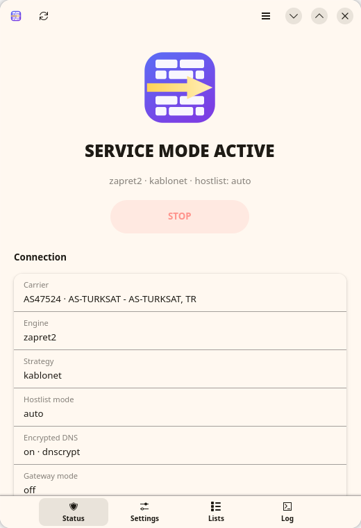

<p align="center">
  
</p>

<h1 align="center">Unwall</h1>

<p align="center">
  A Linux control panel for the <code>zapret</code> / <code>zapret2</code> DPI-bypass engines —
  systemd service, nftables rules, encrypted DNS, gateway mode and a GTK4 interface
  that never runs as root.
</p>

<p align="center">
  <a href="https://github.com/WinTone01/Unwall/releases/latest"></a>
  <a href="LICENSE"></a>
  <a href="https://github.com/WinTone01/Unwall/actions/workflows/ci.yml"></a>
  
</p>

<p align="center">
  <b>English</b> · <a href="README.tr.md">Türkçe</a>
</p>

<p align="center">
  
</p>

---

Unwall wraps [zapret](https://github.com/bol-van/zapret) and
[zapret2](https://github.com/bol-van/zapret2) — the DPI (Deep Packet Inspection)
bypass engines by [@bol-van](https://github.com/bol-van) — into something you can
actually run on a desktop. On Linux the engine is native: instead of a
WinDivert-style driver, the kernel's **netfilter/NFQUEUE** subsystem does the
interception and `nfqws` does the work. Unwall adds carrier presets, hostlist
management, encrypted DNS and diagnostics on top.

Carrier presets currently ship for **Turkey** (the project grew out of
[zapret-win-turkey](https://github.com/alimali54/zapret-win-turkey)); adding your
own country is a one-line change in
[`lib/strategies.conf`](lib/strategies.conf) — see
[CONTRIBUTING.md](CONTRIBUTING.md).

## Contents

- [Features](#features)
- [Installation](#installation)
- [Usage](#usage)
- [Encrypted DNS](#encrypted-dns-the-yogadns-equivalent)
- [Sharing with other devices](#sharing-with-devices-on-your-network-console-tv)
- [Differences from the Windows version](#differences-from-the-windows-version)
- [Project layout](#project-layout)
- [Troubleshooting](#troubleshooting)
- [Contributing](#contributing)
- [License](#license)
- [Credits](#credits)

## Features

| | |
|---|---|
| **Two engines** | the classic `nfqws` (zapret) and the new LUA-based `nfqws2` (zapret2) |
| **Ready-made strategies** | carrier presets (currently `TR ·` Türk Telekom, Superonline, Kablonet, Vodafone, Turkcell/Telekom mobile) plus carrier-independent generic profiles — usable without running blockcheck |
| **Blockcheck** | searches for a strategy that works on your ISP and writes the result straight into the configuration |
| **Hostlist / excludelist** | only blocked domains go through the engine, the rest of your traffic is untouched; `com.tr` and `gov.tr` are excluded by default |
| **systemd service** | starts at boot and keeps running with the GUI closed |
| **Gateway mode** | routes devices on your LAN (console, smart TV) through this machine — the replacement for `go-pcap2socks` + Npcap on Windows |
| **Encrypted DNS** | one switch sets up DoH (`dnscrypt-proxy`, port 443) or DoT (`systemd-resolved`, port 853) — replaces the YogaDNS recommendation from the Windows version, fully reversible |
| **Carrier auto-detection** | looks your ASN up over encrypted DNS and picks the matching profile; optionally re-detects when you move to another network |
| **Diagnostics** | DNS interference check, conflicting-tool and queue detection |
| **English and Turkish** | picks your locale automatically, switchable from the menu (`UW_LANG=en`/`tr` overrides it) |
| **Privilege separation** | the GUI runs as your normal user; privileged work goes through a single helper script via polkit |

## Installation

```bash
./install.sh
```

The script elevates itself once (through `sudo`, or `pkexec` when there is no
`sudo`), so you are asked for your password a single time. This one command:

1. Detects your package manager (`pacman` / `apt` / `dnf` / `zypper`) and
   **installs every required and optional package** (including `dnscrypt-proxy`)
2. Installs the files, the systemd unit, the polkit policy, the icon and the
   application menu entry
3. Builds the `nfqws` and `nfqws2` engines from source

The installer **starts no service and changes no system setting**. DNS,
autostart, strategy selection and gateway mode are all done from the GUI.

Options: `--yes` (no questions), `--no-deps`, `--no-build`, `PREFIX=/usr`.

After installation, **Unwall** appears in your application menu (Network
category); launch it from there or with the `unwall` command.

### Distro packages

| Distro | Command |
|---|---|
| Arch / CachyOS | `cd packaging && makepkg -si` |
| Debian / Ubuntu | `./packaging/build-deb.sh && sudo apt install ./packaging/unwall_*.deb` |
| Fedora / openSUSE | `./packaging/build-rpm.sh && sudo dnf install ./packaging/RPMS/*.rpm` |
| Flatpak (GUI only) | see [`flatpak/README.md`](flatpak/README.md) |
| AppImage (GUI only) | `./packaging/build-appimage.sh` |

The `.deb` and `.rpm` build scripts need `dpkg-dev` and `rpm-build` (or
`rpmbuild`) respectively; they produce a real package from this repository,
they do not download anything prebuilt. Both packages behave exactly like
`install.sh`: no service is started and no system setting is touched until
you do it from the GUI or with `unwallctl`.

The Flatpak and the AppImage are a separate case: they can only contain the
GTK4 interface, not the nftables/systemd/NFQUEUE parts, so either still needs
one of the packages above (or `install.sh`) installed on the host first.

- The **Flatpak** is sandboxed and reaches the host's `unwallctl`/`pkexec`
  through `flatpak-spawn --host`; see [`flatpak/README.md`](flatpak/README.md)
  for why and how.
- The **AppImage** is *not* sandboxed — it runs with your normal user
  permissions like any other binary, so it calls `unwallctl`/`pkexec`
  directly, no bridging needed. It needs `appimagetool`
  (`APPIMAGETOOL=/path/to/it ./packaging/build-appimage.sh` if it is not on
  your `PATH`); the resulting `Unwall-<version>-x86_64.AppImage` is a single
  portable file that still expects the native backend on the machine it runs
  on, same as the Flatpak.

<details>
<summary><b>Upgrading / uninstalling</b></summary>
<br>

**Upgrading from `zapret-turkey`** (the previous name of this project): just run
`./install.sh`. It disables the old service, moves `/etc/zapret-turkey` and
`/opt/zapret-turkey` to the new paths (so the engines are not rebuilt), keeps
your encrypted DNS setup, and removes the old binaries, unit, polkit policy and
menu entry.

To remove everything: `./uninstall.sh` (it also asks for the password only
once). It stops and disables the service, drops the nftables rules, reverts
the encrypted DNS configuration (restoring any `dnscrypt-proxy.toml` it
replaced), deletes the program files, the settings and lists, the compiled
engines and source tree, and the logs — then verifies that nothing is left
behind. Use `--yes` to skip the confirmation, `--keep-config` to preserve
`/etc/unwall`, and `--purge-deps` to remove the `dnscrypt-proxy` package as
well. Other dependencies (nftables, gtk4, luajit …) are left alone because
other software may need them.

</details>

<details>
<summary><b>Installing dependencies manually</b></summary>
<br>

```bash
sudo pacman -S --needed nftables python-gobject libadwaita gtk4 polkit bind gcc make pkgconf git curl luajit libnetfilter_queue libnfnetlink libmnl zlib dnscrypt-proxy
```

```bash
sudo apt install nftables python3-gi gir1.2-adw-1 gir1.2-gtk-4.0 policykit-1 dnsutils build-essential pkg-config git curl libluajit-5.1-dev libnetfilter-queue-dev libnfnetlink-dev libmnl-dev zlib1g-dev dnscrypt-proxy
```

```bash
sudo dnf install nftables python3-gobject libadwaita gtk4 polkit bind-utils gcc make pkgconf git curl luajit-devel libnetfilter_queue-devel libnfnetlink-devel libmnl-devel zlib-devel dnscrypt-proxy
```

`build` clones `bol-van/zapret` and `bol-van/zapret2` into `/opt/unwall/src`
and compiles the `nfqws` / `nfqws2` binaries. Run `sudo unwallctl build`
later to update the engines.

</details>

## Usage

Pick an engine, a strategy and a hostlist mode in the GUI, then press
**START**. Your choices are not applied until you press that button; until
then the status line shows `not applied → ...` and the button reads **APPLY
SETTINGS**. The "start at boot" switch enables the systemd unit, which keeps
running with the GUI closed.

The GUI runs as your normal user; only privileged actions (starting the
engine, the service, DNS, firewall rules) ask for a password through polkit.

From the terminal:

```bash
sudo unwallctl start STRATEGY=superonline ENGINE=zapret2
```

| Command | What it does |
|---|---|
| `unwallctl status` | current state (key=value) |
| `unwallctl strategies [engine]` | list ready-made strategies |
| `unwallctl config get\|set` | read / write settings |
| `sudo unwallctl start\|stop\|restart` | run / stop the engine |
| `sudo unwallctl enable\|disable` | start at boot |
| `sudo unwallctl blockcheck [engine]` | ISP analysis |
| `unwallctl dnscheck [domain]` | DNS interference check |
| `unwallctl detect-isp` | look the carrier up from your ASN, suggest a profile |
| `unwallctl hostlist show LIST` | print a list (`manual`/`auto`/`exclude`) |
| `sudo unwallctl hostlist add\|remove LIST DOMAIN` | add / remove a domain |
| `sudo unwallctl dns enable\|disable` | turn encrypted DNS (DoT/DoH) on / off |
| `unwallctl dns status\|test` | encrypted DNS state / test |
| `unwallctl doctor` | environment and conflict diagnostics |
| `sudo unwallctl disable-conflicts` | shut down conflicting DPI tools |
| `unwallctl print-cmd`, `print-nft` | show the generated command and rules |
| `unwallctl conncheck [domains]` | try a real TLS handshake against a few targets |
| `sudo unwallctl verify [--all]` | measure learned domains and verify them (drops false positives) |
| `sudo unwallctl prune` | drop list entries whose domain no longer resolves |
| `sudo unwallctl verify-timer on\|off` | turn periodic verification on / off |
| `sudo unwallctl tune [--apply]` | measure candidate strategies against sites that are really blocked |
| `sudo unwallctl watchdog` | measure whether the strategy still works |
| `unwallctl profile show\|save\|apply` | per-network strategy profile |
| `sudo unwallctl hotspot on\|off` | broadcast a Wi-Fi network for a console / TV |
| `unwallctl report` | the whole state in one command (the GUI's Health page reads this) |
| `unwallctl blockcheck-results [engine]` | list every working strategy from the last blockcheck |
| `unwallctl update-check` | check GitHub for a newer release (key=value) |
| `sudo unwallctl self-update [version]` | download and install a release (defaults to latest) |

**Configuration**: `/etc/unwall/unwall.conf`
**Lists**: `/etc/unwall/{hostlist,excludelist,autohostlist,autohostlist-pending}.txt`

### Auto-learning and false positives

With `HOSTLIST_MODE=auto` the engine learns which domains look blocked by
itself. That detection is a guess: a failed connection does not mean a
blocked one. A site that is briefly down, a wifi hiccup or a telemetry
endpoint that never answers all look the same. Over time the list fills up
with domains that were never blocked — on one test machine, 368 of 497
entries (74%) were exactly that: `ping.archlinux.org`,
`connectivitycheck.gstatic.com`, `csi.gstatic.com`,
`incoming.telemetry.mozilla.org`, …

That is not just noise: applying a strategy to a domain that is not blocked
can break it.

Since v1.5, learned domains no longer go straight into the permanent list:

1. **Quarantine.** New learnings are written to
   `autohostlist-pending.txt`. The strategy is applied to those domains too
   (so nothing gets slower), but they only reach the permanent
   `autohostlist.txt` once verified.
2. **Measurement.** `unwallctl verify` opens two connections per domain: one
   **without** the DPI bypass and one normally. The bypass-free one never
   enters the nftables queue because a rule marks the traffic of a dedicated
   system user (`unwall-probe`) with the engine's own fwmark — so the
   measurement needs no rule teardown and does not disturb live traffic.
3. **Verdict.** One of four:

| Verdict | Meaning | Action |
|---|---|---|
| `false-positive` | opens fine without the bypass | removed (a second clearing from quarantine also adds it to the exclude list) |
| `blocked` | closed without the bypass, open with it | promoted to the permanent list |
| `still-blocked` | closed both ways, signature looks like interference | kept — **the block is real but the strategy does not beat it** |
| `not-dpi` | host is alive, but the problem is its certificate / TLS setup | removed (desync cannot fix that) |
| `invalid` | the name does not resolve at all | removed |
| `unreachable` | dead host (not even a bare TCP connection to 443) | removed |
| `skipped-ip` | raw IP entry | left alone |

The distinction comes from `curl`'s exit code, and getting it right matters
more than it sounds: a WebSocket endpoint (`ws-eu.pusher.com`) answers **HTTP
426** and then closes the stream, and a live host whose certificate does not
match the name fails TLS — neither of those is "blocked". A probe counts as
successful the moment the server returns any HTTP status; a TLS cut
(`35/52/56`) is read as interference, while certificate errors
(`51/58/59/60/…`) mean a live host. On a timeout, a bare TCP connection to 443
decides it: if that succeeds the host is alive and the cut happens during the
handshake.

### Pruning invalid domains

Lists collect junk over time: expired names, temporary CDN hostnames, typos.
This clears them without any DPI measurement, by asking only whether the name
exists:

```bash
sudo unwallctl prune
```

The question goes to Cloudflare DoH over 443/TLS, not to the ISP's DNS — asking
in plaintext would make **every** domain look gone on a network that poisons
DNS, and wipe the list. Nothing is removed when DoH cannot be reached. Only the
lists the engine populates are touched; `hostlist.txt` and `excludelist.txt`
are yours.

```bash
sudo unwallctl verify          # verify what is in quarantine
sudo unwallctl verify --all    # audit the permanent list as well
sudo unwallctl verify-timer on # do it automatically, hourly
```

Hostlists are reloaded by the engine as soon as they change; no restart is
needed.

> [!NOTE]
> The measurement runs over TCP/443. A domain that is only blocked over QUIC
> can look reachable here, which is why entries dropped from the **permanent**
> list are never auto-excluded — they are only removed, and the engine can
> learn them again. To pin a domain permanently, put it in `hostlist.txt`:
> `verify` never touches that file. Raw IP entries are skipped as well
> (`https://<ip>` always fails certificate validation).

**Logs**: `journalctl -u unwall -f` and `/var/log/unwall/`

The GUI checks GitHub for a newer release once a day in the background (no
network access is required otherwise) and shows a dismissible banner with a
link to the release when one is found. Force a check from the menu
(**Check for updates**) or from the terminal:

```bash
unwallctl update-check
```

Clicking **Update now** on the banner (or running `sudo unwallctl self-update`
yourself) downloads that release's source tarball and runs its `install.sh
--no-deps --no-build`: the CLI, GUI, systemd unit, polkit policy, icon and
menu entry are refreshed; packages and the compiled engines are left alone,
and nothing is started or stopped in the process — same guarantees as running
`install.sh` by hand. This only applies if you installed with `install.sh` in
the first place; if you used a distro package (`.deb`/`.rpm`/AUR), update
through your package manager instead, since `self-update` would just get
overwritten by the next `apt`/`dnf`/`pacman` upgrade anyway.

## Encrypted DNS (the YogaDNS equivalent)

If your ISP tampers with DNS, zapret alone is not enough. The **Encrypted
DNS** switch in the GUI, or the `unwallctl dns` command, sets this up for
you — no manual file editing.

| Method | Transport | Notes |
|---|---|---|
| **DoH** — `dnscrypt-proxy` | 443/tcp | Indistinguishable from ordinary HTTPS, hard to block. Requires the `dnscrypt-proxy` package. |
| **DoT** — `systemd-resolved` | 853/tcp | No extra package needed, but 853 is a separate port that some ISPs close. |

```bash
sudo unwallctl dns enable cloudflare auto
```

`auto` picks DoH when `dnscrypt-proxy` is installed and falls back to DoT.
Providers: `cloudflare`, `google` or `quad9`.

```bash
unwallctl dns test
sudo unwallctl dns disable
```

<details>
<summary>What happens under the hood</summary>
<br>

- **DoT**: a drop-in at `/etc/systemd/resolved.conf.d/90-unwall.conf`
  with `DNSOverTLS=yes` and the provider's servers. `Domains=~.` makes these
  win over the ISP servers handed out by DHCP; links with their own search
  domains (VPN, Tailscale) are unaffected.
- **DoH**: `dnscrypt-proxy` runs as a DoH client on `127.0.0.1:5300` and
  `systemd-resolved` uses it as its upstream. An existing
  `dnscrypt-proxy.toml` is backed up as `.unwall.bak` before being
  replaced; `dns disable` restores it.

`dns disable` reverts both changes — the uninstall script calls it too.

</details>

## Sharing with devices on your network (console, TV)

Turn on the **Gateway mode** switch. This machine becomes a NAT router for
the local network (`ip_forward` + `nft masquerade`) and the forwarded
traffic goes through zapret as well. The Npcap + `go-pcap2socks` layer used
on Windows is not needed; routing is done by the kernel.

DNS is handled the same way `go-pcap2socks` handled it on Windows, just with
a kernel rule instead of a bundled proxy: an nftables rule transparently
redirects every DNS query (TCP and UDP, port 53) coming from the LAN to a
resolver on this machine. **Whatever DNS server the device is configured with
is ignored** — the device's packets never actually leave your network toward
that address, they get rewritten to this machine before they do.

On networks that hijack *every* packet sent to port 53 and answer it
themselves (Türk Telekom and TT Mobil do), this is the only thing that works:
as long as the console's own DNS query reaches the ISP, it never learns the
real IP of a blocked site, and the connection goes to the wrong address even
though DPI bypass itself is working.

The redirect target is picked automatically:

- **With encrypted DNS over DoH (dnscrypt-proxy)**, queries go straight to
  `127.0.0.1:5300`, i.e. into the encrypted channel. This is the recommended
  setup for consoles and TVs: `unwallctl dns enable cloudflare dnscrypt` (or
  Encrypted DNS + Method: DoH in the GUI).
- **With encrypted DNS off, or on DoT (systemd-resolved)**, a second listener
  is opened on the LAN address (`DNSStubListenerExtra` in
  `/etc/systemd/resolved.conf.d/91-unwall-gateway.conf`) and queries are sent
  there. resolved's main `127.0.0.53` stub only answers queries coming from a
  local address and silently drops the ones redirected from the LAN, so
  pointing the rule at it does not work. The listener is removed again when
  gateway mode is turned off.
- **With no usable target**, the redirect rule is not installed at all — a
  device using its own DNS beats a black-holed one. The GUI's Status page then
  says *device DNS not redirected* under "Gateway mode", and `unwallctl doctor`
  flags the "ağ geçidi DNS" row.

In the manual network settings of the device (PlayStation, Xbox, Switch, TV):

| Field | Value |
|---|---|
| IP address | a free address on your network, e.g. `192.168.1.50` |
| Subnet mask | same as your network, usually `255.255.255.0` |
| Gateway | this computer's LAN IP (shown in the "LAN address" row of the GUI) |
| DNS | any valid-looking value, e.g. `1.1.1.1` — most devices refuse an empty field, but the actual value is overridden by the redirect above |

> [!NOTE]
> If a firewall such as `firewalld` or `ufw` drops packets in the `forward`
> chain by default (ufw's `DEFAULT_FORWARD_POLICY` is `DROP` out of the box
> on many distros), gateway mode devices get "connected, no internet".
> Since v1.3.14, `unwallctl` detects this and adds a targeted `ufw route
> allow` rule (or `firewall-cmd --add-forward` on firewalld) automatically
> whenever gateway mode is applied — no manual firewall changes needed.
> `unwallctl doctor` / the GUI's Diagnostics show what was detected under
> "gateway forwarding".

> [!NOTE]
> The DNS redirect needs a second ufw rule: once the query is redirected
> its destination is this machine itself, so the packet goes through
> `INPUT` rather than `forward` and the `ufw route allow` rule above does
> not cover it — with ufw's default deny-incoming policy it dies as
> `[UFW BLOCK] ... DST=127.0.0.1 DPT=5300`. Since v1.4.2 `unwallctl` also
> adds a targeted allow rule for the redirect destination (visible with the
> `# unwall dns redirect` comment) and removes it when gateway mode is
> turned off. `doctor` warns under "ağ geçidi DNS" if the rule is in place
> but the allowance is missing.

## Self-tuning (v2.0)

Whether a strategy works is not something to guess, it is something to
measure. All four v2.0 features share the same measurement plumbing: the
traffic of a dedicated `unwall-probe` user is marked with the engine's
fwmark, the queue rules skip marked packets, and so a "without the bypass"
connection can be made without touching any rules.

### Finding the best strategy

```bash
sudo unwallctl tune            # measure and suggest
sudo unwallctl tune --apply    # measure and apply the winner
sudo unwallctl tune --deep     # wider parameter search
```

Unlike `blockcheck`, this **never disturbs your own connection**: the
candidate runs in a second engine instance on its own queue (`QNUM+1`), and
only the probe user's traffic is routed there. You keep browsing on the
current strategy while it runs.

The test set is measured too: a sample is taken from your verified list and
only the domains that are **actually blocked right now** are kept. The
candidates are the ready-made profiles plus a parameter grid (fake packet
TTL and split method), deduplicated by arguments. The search stops as soon
as a candidate passes everything, and no candidate is tried at all if the
current strategy already does.

A winner that came from the grid is stored as `STRATEGY=analiz` plus
`CUSTOM_ARGS`.

### Per-network profiles

Home, a mobile hotspot and a school network go through different DPI. Save
the strategy that works on one, and it comes back when you return.

```bash
unwallctl profile show     # this network's fingerprint and saved profile
sudo unwallctl profile save
unwallctl profile list
```

The fingerprint is the Wi-Fi SSID, else the default gateway's MAC address,
else the router IP. When the network changes, a NetworkManager dispatcher
hook (`/etc/NetworkManager/dispatcher.d/90-unwall`) calls `profile apply
--auto`, which does nothing when that network has no saved profile.

### The watchdog

A strategy can stop working overnight - the ISP updates its DPI and the user
experiences it as "the internet broke". The watchdog opens a few domains
that were **measured** as blocked and checks whether the current strategy
still gets through.

```bash
sudo unwallctl watchdog            # check now
sudo unwallctl watchdog-timer on   # check every 30 minutes
```

If fewer than half open, the strategy counts as broken (a single failure can
just be that site, hence the ratio). With `WATCHDOG_ACTION=tune` it runs
auto-tune and applies the winner; the default `notify` only reports, to the
GUI's Health page and `journalctl -u unwall-watchdog`.

### Hotspot (AP mode)

If your wireless card supports AP mode, a console does not need any manual
IP settings at all: the machine broadcasts its own Wi-Fi network and the
device simply joins it.

```bash
sudo unwallctl hotspot on            # SSID: Unwall, a password is generated and printed
sudo unwallctl hotspot on MyNet yourpassword
sudo unwallctl hotspot status
```

DHCP and DNS come from NetworkManager's "shared" mode (dnsmasq); Unwall only
turns on the gateway rules. If your card cannot be a client and an access
point at the same time and your internet arrives on that same card, the
connection may drop - the command warns about this first.

### The Health page

The new **Health** tab in the GUI shows all of it in one place: the last
watchdog check, a "Measure and apply" button, this network's profile, the
hotspot switch and the list counts. The same data is available from the
terminal with `unwallctl report`.

> [!NOTE]
> In gateway mode a device's IPv6 comes straight from the router and never
> passes through this machine - so it bypasses Unwall. If a blocked site is
> reachable over IPv6, turn IPv6 off on the device. For this machine's own
> IPv6 traffic, `ENABLE_IPV6=1` is enough.


## Differences from the Windows version

| Windows | Linux equivalent |
|---|---|
| `winws.exe` / `winws2.exe` | `nfqws` / `nfqws2` |
| WinDivert driver | netfilter NFQUEUE (`nfnetlink_queue`) |
| `--wf-tcp` / `--wf-udp` / `--wf-l3` | nftables rules (`queue num ... bypass`) |
| `sc create ZapretService` | `unwall.service` (systemd) |
| UAC / `#RequireAdmin` | polkit + `pkexec` (only the helper script is elevated) |
| Npcap + `go-pcap2socks` | `ip_forward` + `nft masquerade` |
| YogaDNS (installed by hand) | built-in DoH/DoT via `dns enable` (`dnscrypt-proxy` / `systemd-resolved`) |
| `nslookup`, `ipconfig /flushdns` | `dig`, `resolvectl flush-caches` |
| GoodbyeDPI conflict check | `nfqws`/`tpws`/`byedpi`/TUN and queue conflicts (`doctor`) |
| `config.ini` | `/etc/unwall/unwall.conf` |
| AutoIt GUI | GTK4 + libadwaita (Python) |

The strategy parameters themselves (`--dpi-desync=…`, `--lua-desync=…`,
`--hostlist…`) are identical on both platforms; only the layer that steers
traffic into the engine differs.

## Project layout

```
bin/unwallctl          all privileged work (CLI + polkit target)
bin/unwall             GUI launcher
gui/unwall_gui.py      GTK4 / libadwaita interface (host-aware: works from a Flatpak too)
lib/strategies.conf    ready-made strategy profiles
etc/unwall.conf        default configuration
systemd/unwall.service systemd unit
polkit/…policy         privilege escalation policy
packaging/PKGBUILD     Arch package
packaging/debian/      .deb control files (see build-deb.sh)
packaging/unwall.spec  Fedora/openSUSE .rpm spec (see build-rpm.sh)
flatpak/                Flatpak manifest for the GUI (see flatpak/README.md)
packaging/appimage/     AppRun for the AppImage (see build-appimage.sh)
docs/screenshots/      interface screenshots
```

## Troubleshooting

```bash
unwallctl doctor
```

Run the GUI from a terminal and everything is logged to the console; for more
detail:

```bash
UW_DEBUG=1 unwall
```

The application is single-instance: if a window opened from the menu is already
running, launching it from a terminal only raises that window and prints no
logs. To get a separate instance while debugging:

```bash
UW_NO_UNIQUE=1 UW_DEBUG=1 unwall
```

<details open>
<summary><b>Common issues</b></summary>
<br>

- **The engine will not start**: `journalctl -u unwall -n 50`
- **My strategy selection reverts**: the selection is only pending until you
  press **APPLY SETTINGS** / **START**; the status line shows it as
  `not applied → ...`.
- **Nothing changed**: check that the rules are loaded with
  `sudo nft list table ip unwall`; if the hostlist mode is `manual`, make
  sure the domain is in the list.
- **QUIC/HTTP3 sites broke**: set `PORTS_UDP=` (empty) in the configuration.
- **`Automatic (zapret learns)` hostlist mode isn't adding new domains**:
  it only adds a domain after it sees a recognizable "blocked connection"
  pattern (since v1.3.8: 1 failed attempt; the engine's own default is 3
  within 60 seconds, which we lower with `--hostlist-auto-fail-threshold=1`
  so one bad load is enough — a single attempt still needs 3 TCP
  retransmits by default, so a random network blip won't count) for a
  domain that *isn't already desynced*. If your strategy already gets
  through cleanly, that pattern never happens and the domain is correctly
  never added.
  Before v1.3.6, genuinely blocked domains could also fail to be learned
  because only outgoing traffic was queued to the engine — zapret2's own
  auto-hostlist detector needs to see the *reply* direction too (an
  injected RST or an HTTP redirect to a block page), which v1.3.6's
  nftables rules now queue as well. If you're still on an older version,
  upgrade first. Watch `sudo tail -f /var/log/unwall/hostlist-auto.log`
  while browsing to a blocked site to see what the engine is actually
  observing — a completely empty log after several failed loads means the
  reply direction still isn't reaching the engine.
- **Another DPI tool is running**: `byedpi`, `tpws`, the upstream
  `zapret.service` or a VPN that creates a TUN device will fight over the queue.
- **Upstream zapret is already installed** (`/opt/zapret`, `zapret.service`):
  do not run both at once — `sudo systemctl disable --now zapret`. This
  project defaults to queue number `210` to reduce collisions (upstream uses
  `200`). You can also skip the `build` step and use the existing
  `/opt/zapret` and `/opt/zapret2` binaries; they are looked up automatically
  when no locally built engine is found.

</details>

Still stuck? Open an issue using the
[bug report template](https://github.com/WinTone01/Unwall/issues/new/choose)
— filling in its environment table (version, install method, distro, engine,
strategy, hostlist mode) up front is the single biggest time-saver.

## Contributing

Bug reports, strategy presets for other countries and pull requests are all
welcome — see [CONTRIBUTING.md](CONTRIBUTING.md) for how the project is laid
out, what CI checks on every push, and what to verify locally before opening
a PR.

## License

Unwall is licensed under the
[GNU General Public License v3.0](LICENSE) or later. You are free to run,
study, share and modify it; if you distribute a modified version, it must
stay under the same license and come with its source.

## Credits

- [@WinTone01](https://github.com/WinTone01) — created Unwall: the Linux port
  itself (`unwallctl`, the systemd/nftables/polkit integration, the GTK4
  interface, encrypted DNS, gateway mode, the update checker) and maintains
  the project.
- [@alimali54](https://github.com/alimali54) for
  [zapret-win-turkey](https://github.com/alimali54/zapret-win-turkey), the
  Windows version this project is based on
- [@bol-van](https://github.com/bol-van) for the zapret and zapret2 engines
- [@cagritaskn](https://github.com/cagritaskn), developer of
  [splitwire-turkey](https://github.com/cagritaskn/splitwire-turkey), for the
  automatic blockcheck logic and the strategy presets
- [@DaniilSokolyuk](https://github.com/DaniilSokolyuk), developer of
  [go-pcap2socks](https://github.com/DaniilSokolyuk/go-pcap2socks), for the LAN
  sharing idea used in the Windows version
