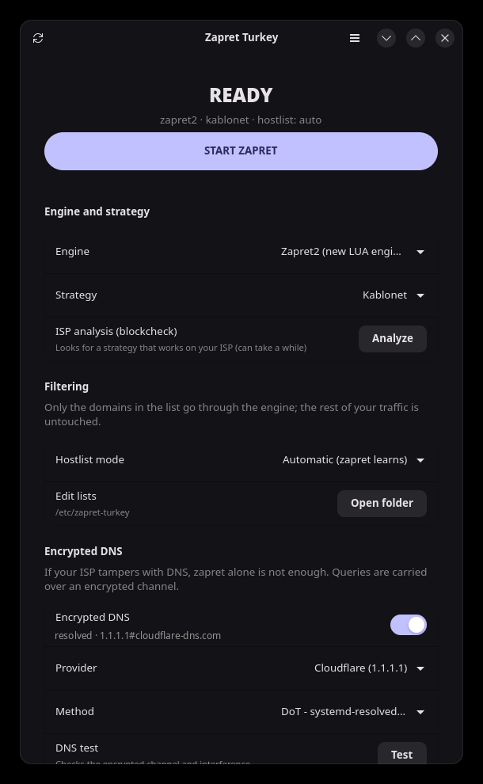
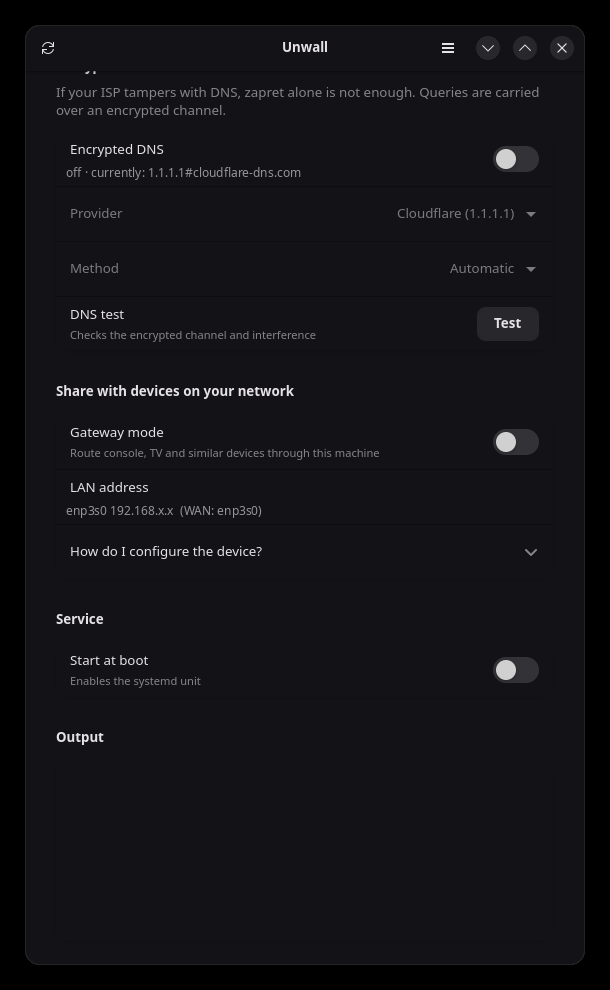

<p align="center">
  
</p>

<h1 align="center">Unwall</h1>

<p align="center">
  <a href="LICENSE"></a>
</p>

**English** · [Türkçe](README.tr.md)

A Linux control panel for [zapret](https://github.com/bol-van/zapret) and
[zapret2](https://github.com/bol-van/zapret2) — the DPI (Deep Packet Inspection)
bypass engines by @bol-van. Unwall turns them into something you can actually
run on a desktop: a systemd service, nftables rules, encrypted DNS, gateway mode
for your consoles, and a GTK4 interface that never runs as root.

<p align="center">
  
  
</p>

On Linux the engine is native: instead of a WinDivert-style driver the kernel's
**netfilter/NFQUEUE** subsystem does the interception and `nfqws` does the work.
Unwall wraps that engine with carrier presets, hostlist management, encrypted
DNS and diagnostics.

Carrier presets currently ship for **Turkey** (the project grew out of
[zapret-win-turkey](https://github.com/alimali54/zapret-win-turkey)); adding
your own country is a one-line change in
[`lib/strategies.conf`](lib/strategies.conf) and pull requests are welcome.

## Features

- **Two engines**: the classic `nfqws` (zapret) and the new LUA-based `nfqws2`
  (zapret2).
- **Ready-made strategies**: carrier presets (currently `TR ·` Türk Telekom,
  Superonline, Kablonet, Vodafone, Turkcell/Telekom mobile) plus
  carrier-independent generic profiles — usable without running blockcheck.
- **Blockcheck**: searches for a strategy that works on your ISP and writes the
  result straight into the configuration.
- **Hostlist / excludelist**: only blocked domains go through the engine, so the
  rest of your traffic is untouched. `com.tr` and `gov.tr` are excluded by
  default.
- **systemd service**: starts at boot and keeps running with the GUI closed.
- **Gateway mode**: routes devices on your LAN (console, smart TV) through this
  machine — the replacement for `go-pcap2socks` + Npcap on Windows.
- **Encrypted DNS**: one switch sets up DoH (`dnscrypt-proxy`, port 443) or DoT
  (`systemd-resolved`, port 853). This replaces the YogaDNS recommendation from
  the Windows version, and it is fully reversible.
- **Diagnostics**: DNS interference check, conflicting tool and queue detection.
- **English and Turkish**: the interface picks your locale automatically and can
  be switched from the menu (Language); `UW_LANG=en` / `UW_LANG=tr` override it.
- **Privilege separation**: the GUI runs as your normal user; privileged work
  goes through a single helper script via polkit.

## Installation

```bash
./install.sh
```

The script elevates itself once (through `sudo`, or `pkexec` when there is no
`sudo`), so you are asked for your password a single time. This one command:

1. Detects your package manager (`pacman` / `apt` / `dnf` / `zypper`) and
   **installs every required and optional package** (including `dnscrypt-proxy`)
2. Installs the files, the systemd unit, the polkit policy, the icon and the
   application menu entry
3. Builds the `nfqws` and `nfqws2` engines from source

The installer **starts no service and changes no system setting**. DNS,
autostart, strategy selection and gateway mode are all done from the GUI.

Options: `--yes` (no questions), `--no-deps`, `--no-build`, `PREFIX=/usr`.

After installation, **Unwall** appears in your application menu (Network
category); launch it from there or with the `unwall` command.

### Distro packages

| Distro | Command |
|---|---|
| Arch / CachyOS | `cd packaging && makepkg -si` |
| Debian / Ubuntu | `./packaging/build-deb.sh && sudo apt install ./packaging/unwall_*.deb` |
| Fedora / openSUSE | `./packaging/build-rpm.sh && sudo dnf install ./packaging/RPMS/*.rpm` |
| Flatpak (GUI only) | see [`flatpak/README.md`](flatpak/README.md) |
| AppImage (GUI only) | `./packaging/build-appimage.sh` |

The `.deb` and `.rpm` build scripts need `dpkg-dev` and `rpm-build` (or
`rpmbuild`) respectively; they produce a real package from this repository,
they do not download anything prebuilt. Both packages behave exactly like
`install.sh`: no service is started and no system setting is touched until
you do it from the GUI or with `unwallctl`.

The Flatpak and the AppImage are a separate case: they can only contain the
GTK4 interface, not the nftables/systemd/NFQUEUE parts, so either still needs
one of the packages above (or `install.sh`) installed on the host first.

- The **Flatpak** is sandboxed and reaches the host's `unwallctl`/`pkexec`
  through `flatpak-spawn --host`; see [`flatpak/README.md`](flatpak/README.md)
  for why and how.
- The **AppImage** is *not* sandboxed — it runs with your normal user
  permissions like any other binary, so it calls `unwallctl`/`pkexec`
  directly, no bridging needed. It needs `appimagetool`
  (`APPIMAGETOOL=/path/to/it ./packaging/build-appimage.sh` if it is not on
  your `PATH`); the resulting `Unwall-<version>-x86_64.AppImage` is a single
  portable file that still expects the native backend on the machine it runs
  on, same as the Flatpak.

**Upgrading from `zapret-turkey`** (the previous name of this project): just run
`./install.sh`. It disables the old service, moves `/etc/zapret-turkey` and
`/opt/zapret-turkey` to the new paths (so the engines are not rebuilt), keeps
your encrypted DNS setup, and removes the old binaries, unit, polkit policy and
menu entry.

To remove everything: `./uninstall.sh` (it also asks for the password only
once). It stops and disables the service,
drops the nftables rules, reverts the encrypted DNS configuration (restoring any
`dnscrypt-proxy.toml` it replaced), deletes the program files, the settings and
lists, the compiled engines and source tree, and the logs — then verifies that
nothing is left behind. Use `--yes` to skip the confirmation, `--keep-config` to
preserve `/etc/unwall`, and `--purge-deps` to remove the `dnscrypt-proxy`
package as well. Other dependencies (nftables, gtk4, luajit …) are left alone
because other software may need them.

<details>
<summary>Installing dependencies manually</summary>

```bash
sudo pacman -S --needed nftables python-gobject libadwaita gtk4 polkit bind gcc make pkgconf git curl luajit libnetfilter_queue libnfnetlink libmnl zlib dnscrypt-proxy
```

```bash
sudo apt install nftables python3-gi gir1.2-adw-1 gir1.2-gtk-4.0 policykit-1 dnsutils build-essential pkg-config git curl libluajit-5.1-dev libnetfilter-queue-dev libnfnetlink-dev libmnl-dev zlib1g-dev dnscrypt-proxy
```

```bash
sudo dnf install nftables python3-gobject libadwaita gtk4 polkit bind-utils gcc make pkgconf git curl luajit-devel libnetfilter_queue-devel libnfnetlink-devel libmnl-devel zlib-devel dnscrypt-proxy
```

</details>

`build` clones `bol-van/zapret` and `bol-van/zapret2` into
`/opt/unwall/src` and compiles the `nfqws` / `nfqws2` binaries. Run
`sudo unwallctl build` later to update the engines.

## Usage

Pick an engine, a strategy and a hostlist mode in the GUI, then press
**ZAPRET'İ BAŞLAT** (start). Your choices are not applied until you press that
button; until then the status line shows `uygulanmadı → ...` (not applied) and
the button reads **AYARLARI UYGULA** (apply settings). The "start at boot"
switch enables the systemd unit, which keeps running with the GUI closed.

The GUI runs as your normal user; only privileged actions (starting the engine,
the service, DNS, firewall rules) ask for a password through polkit.

From the terminal:

```bash
sudo unwallctl start STRATEGY=superonline ENGINE=zapret2
```

| Command | What it does |
|---|---|
| `unwallctl status` | current state (key=value) |
| `unwallctl strategies [engine]` | list ready-made strategies |
| `unwallctl config get\|set` | read / write settings |
| `sudo unwallctl start\|stop\|restart` | run / stop the engine |
| `sudo unwallctl enable\|disable` | start at boot |
| `sudo unwallctl blockcheck [engine]` | ISP analysis |
| `unwallctl dnscheck [domain]` | DNS interference check |
| `sudo unwallctl dns enable\|disable` | turn encrypted DNS (DoT/DoH) on / off |
| `unwallctl dns status\|test` | encrypted DNS state / test |
| `unwallctl doctor` | environment and conflict diagnostics |
| `sudo unwallctl disable-conflicts` | shut down conflicting DPI tools |
| `unwallctl print-cmd`, `print-nft` | show the generated command and rules |
| `unwallctl update-check` | check GitHub for a newer release (key=value) |
| `sudo unwallctl self-update [version]` | download and install a release (defaults to latest) |

Configuration: `/etc/unwall/unwall.conf`
Lists: `/etc/unwall/{hostlist,excludelist,autohostlist}.txt`
Logs: `journalctl -u unwall -f` and `/var/log/unwall/`

The GUI checks GitHub for a newer release once a day in the background (no
network access is required otherwise) and shows a dismissible banner with a
link to the release when one is found. Force a check from the menu
(**Check for updates**) or from the terminal:

```bash
unwallctl update-check
```

Clicking **Update now** on the banner (or running `sudo unwallctl self-update`
yourself) downloads that release's source tarball and runs its `install.sh
--no-deps --no-build`: the CLI, GUI, systemd unit, polkit policy, icon and
menu entry are refreshed; packages and the compiled engines are left alone,
and nothing is started or stopped in the process — same guarantees as running
`install.sh` by hand. This only applies if you installed with `install.sh` in
the first place; if you used a distro package (`.deb`/`.rpm`/AUR), update
through your package manager instead, since `self-update` would just get
overwritten by the next `apt`/`dnf`/`pacman` upgrade anyway.

## Encrypted DNS (the YogaDNS equivalent)

If your ISP tampers with DNS, zapret alone is not enough. The **Şifreli DNS**
(encrypted DNS) switch in the GUI, or the `unwallctl dns` command, sets
this up for you — no manual file editing.

| Method | Transport | Notes |
|---|---|---|
| **DoH** — `dnscrypt-proxy` | 443/tcp | Indistinguishable from ordinary HTTPS, hard to block. Requires the `dnscrypt-proxy` package. |
| **DoT** — `systemd-resolved` | 853/tcp | No extra package needed, but 853 is a separate port that some ISPs close. |

```bash
sudo unwallctl dns enable cloudflare auto
```

`auto` picks DoH when `dnscrypt-proxy` is installed and falls back to DoT.
Providers: `cloudflare`, `google` or `quad9`.

```bash
unwallctl dns test
sudo unwallctl dns disable
```

What happens under the hood:

- **DoT**: a drop-in at `/etc/systemd/resolved.conf.d/90-unwall.conf`
  with `DNSOverTLS=yes` and the provider's servers. `Domains=~.` makes these
  win over the ISP servers handed out by DHCP; links with their own search
  domains (VPN, Tailscale) are unaffected.
- **DoH**: `dnscrypt-proxy` runs as a DoH client on `127.0.0.1:5300` and
  `systemd-resolved` uses it as its upstream. An existing
  `dnscrypt-proxy.toml` is backed up as `.unwall.bak` before being
  replaced; `dns disable` restores it.

`dns disable` reverts both changes — the uninstall script calls it too.

## Sharing with devices on your network (console, TV)

Turn on the **Ağ geçidi modu** (gateway mode) switch. This machine becomes a
NAT router for the local network (`ip_forward` + `nft masquerade`) and the
forwarded traffic goes through zapret as well. The Npcap + `go-pcap2socks`
layer used on Windows is not needed; routing is done by the kernel.

DNS is handled the same way `go-pcap2socks` handled it on Windows, just with
a kernel rule instead of a bundled proxy: an nftables rule transparently
redirects every DNS query (TCP and UDP, port 53) coming from the LAN to this
machine's own resolver — the same one it uses itself, including encrypted
DNS if you've turned that on. **Whatever DNS server the device is configured
with is ignored**; if your ISP blocks port 53 outbound, that's exactly why
this exists — the device's packets never actually leave your network toward
that address, they get rewritten to this machine before they do.

In the manual network settings of the device (PlayStation, Xbox, Switch, TV):

- **IP address**: a free address on your network (e.g. `192.168.1.50`)
- **Subnet mask**: same as your network (usually `255.255.255.0`)
- **Gateway**: this computer's LAN IP (shown in the "LAN adresi" row of the GUI)
- **DNS**: any valid-looking value works (e.g. `1.1.1.1`) — most devices
  refuse to proceed with an empty DNS field, but the actual value is
  overridden by the redirect above

Note: if a firewall such as `firewalld` or `ufw` drops packets in the `forward`
chain by default, you need to allow forwarding.

## Differences from the Windows version

| Windows | Linux equivalent |
|---|---|
| `winws.exe` / `winws2.exe` | `nfqws` / `nfqws2` |
| WinDivert driver | netfilter NFQUEUE (`nfnetlink_queue`) |
| `--wf-tcp` / `--wf-udp` / `--wf-l3` | nftables rules (`queue num ... bypass`) |
| `sc create ZapretService` | `unwall.service` (systemd) |
| UAC / `#RequireAdmin` | polkit + `pkexec` (only the helper script is elevated) |
| Npcap + `go-pcap2socks` | `ip_forward` + `nft masquerade` |
| YogaDNS (installed by hand) | built-in DoH/DoT via `dns enable` (`dnscrypt-proxy` / `systemd-resolved`) |
| `nslookup`, `ipconfig /flushdns` | `dig`, `resolvectl flush-caches` |
| GoodbyeDPI conflict check | `nfqws`/`tpws`/`byedpi`/TUN and queue conflicts (`doctor`) |
| `config.ini` | `/etc/unwall/unwall.conf` |
| AutoIt GUI | GTK4 + libadwaita (Python) |

The strategy parameters themselves (`--dpi-desync=…`, `--lua-desync=…`,
`--hostlist…`) are identical on both platforms; only the layer that steers
traffic into the engine differs.

## Project layout

```
bin/unwallctl          all privileged work (CLI + polkit target)
bin/unwall             GUI launcher
gui/unwall_gui.py      GTK4 / libadwaita interface (host-aware: works from a Flatpak too)
lib/strategies.conf    ready-made strategy profiles
etc/unwall.conf        default configuration
systemd/unwall.service systemd unit
polkit/…policy         privilege escalation policy
packaging/PKGBUILD     Arch package
packaging/debian/      .deb control files (see build-deb.sh)
packaging/unwall.spec  Fedora/openSUSE .rpm spec (see build-rpm.sh)
flatpak/                Flatpak manifest for the GUI (see flatpak/README.md)
packaging/appimage/     AppRun for the AppImage (see build-appimage.sh)
docs/screenshots/      interface screenshots
```

## Troubleshooting

```bash
unwallctl doctor
```

Run the GUI from a terminal and everything is logged to the console; for more
detail:

```bash
UW_DEBUG=1 unwall
```

The application is single-instance: if a window opened from the menu is already
running, launching it from a terminal only raises that window and prints no
logs. To get a separate instance while debugging:

```bash
UW_NO_UNIQUE=1 UW_DEBUG=1 unwall
```

- **The engine will not start**: `journalctl -u unwall -n 50`
- **My strategy selection reverts**: the selection is only pending until you
  press **AYARLARI UYGULA** / **ZAPRET'İ BAŞLAT**; the status line shows it as
  `uygulanmadı → ...`.
- **Nothing changed**: check that the rules are loaded with
  `sudo nft list table ip unwall`; if the hostlist mode is `manual`, make
  sure the domain is in the list.
- **QUIC/HTTP3 sites broke**: set `PORTS_UDP=` (empty) in the configuration.
- **`Automatic (zapret learns)` hostlist mode isn't adding new domains**:
  it only adds a domain after it sees a recognizable "blocked connection"
  pattern (by default: 3 failures within 60 seconds — TCP retransmits, or
  at least 4 outgoing/at most 1 incoming UDP packets) for a domain that
  *isn't already desynced*. If your strategy already gets through cleanly,
  that pattern never happens and the domain is correctly never added.
  Before v1.3.6, genuinely blocked domains could also fail to be learned
  because only outgoing traffic was queued to the engine — zapret2's own
  auto-hostlist detector needs to see the *reply* direction too (an
  injected RST or an HTTP redirect to a block page), which v1.3.6's
  nftables rules now queue as well. If you're still on an older version,
  upgrade first. Watch `sudo tail -f /var/log/unwall/hostlist-auto.log`
  while browsing to a blocked site to see what the engine is actually
  observing — a completely empty log after several failed loads means the
  reply direction still isn't reaching the engine.
- **Another DPI tool is running**: `byedpi`, `tpws`, the upstream
  `zapret.service` or a VPN that creates a TUN device will fight over the queue.
- **Upstream zapret is already installed** (`/opt/zapret`, `zapret.service`):
  do not run both at once — `sudo systemctl disable --now zapret`. This
  project defaults to queue number `210` to reduce collisions (upstream uses
  `200`). You can also skip the `build` step and use the existing
  `/opt/zapret` and `/opt/zapret2` binaries; they are looked up automatically
  when no locally built engine is found.

## License

Unwall is licensed under the
[GNU General Public License v3.0](LICENSE) or later. You are free to run,
study, share and modify it; if you distribute a modified version, it must
stay under the same license and come with its source.

## Credits

- [@WinTone01](https://github.com/WinTone01) — created Unwall: the Linux port
  itself (`unwallctl`, the systemd/nftables/polkit integration, the GTK4
  interface, encrypted DNS, gateway mode, the update checker) and maintains
  the project.
- [@alimali54](https://github.com/alimali54) for
  [zapret-win-turkey](https://github.com/alimali54/zapret-win-turkey), the
  Windows version this project is based on
- [@bol-van](https://github.com/bol-van) for the zapret and zapret2 engines
- [@cagritaskn](https://github.com/cagritaskn), developer of
  [splitwire-turkey](https://github.com/cagritaskn/splitwire-turkey), for the
  automatic blockcheck logic and the strategy presets
- [@DaniilSokolyuk](https://github.com/DaniilSokolyuk), developer of
  [go-pcap2socks](https://github.com/DaniilSokolyuk/go-pcap2socks), for the LAN
  sharing idea used in the Windows version
