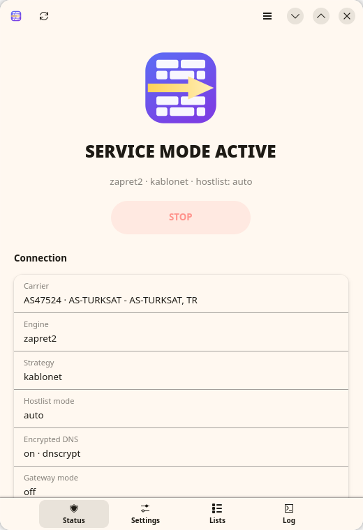
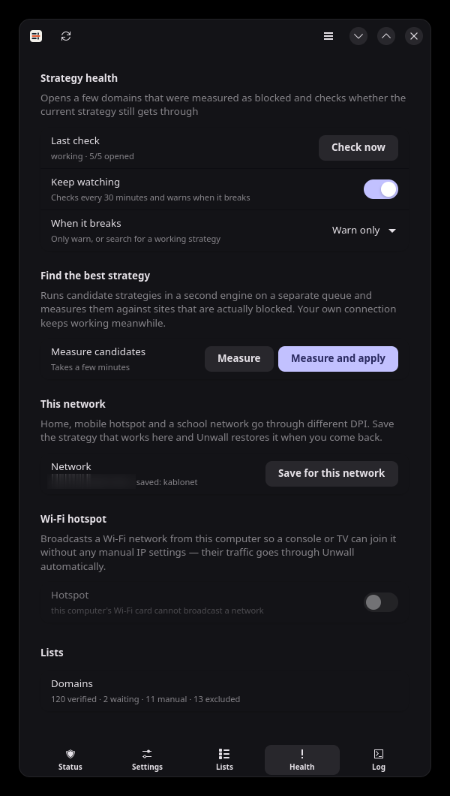
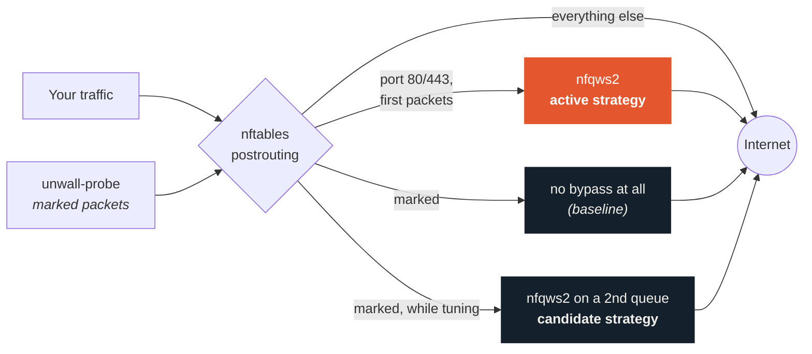

<p align="center">
  
</p>

<h1 align="center">Unwall</h1>

<p align="center">
  <b>A Linux control panel for the <code>zapret</code> / <code>zapret2</code> DPI-bypass engines.</b><br>
  systemd service, nftables rules, encrypted DNS, gateway mode — and a GTK4 interface that never runs as root.
</p>

<p align="center">
  <a href="https://github.com/WinTone01/Unwall/releases/latest"></a>
  <a href="LICENSE"></a>
  <a href="https://github.com/WinTone01/Unwall/actions/workflows/ci.yml"></a>
  
</p>

<p align="center">
  <b>English</b> · <a href="README.tr.md">Türkçe</a>
</p>

<p align="center">
  
  
</p>

<p align="center">
  <sub><b>Status</b> — what is running right now · <b>Health</b> — is it still working, and can it work better</sub>
</p>

---

## What this is

[@bol-van](https://github.com/bol-van)'s **zapret** and **zapret2** are excellent at
what they do and completely command-line driven: hand-written nftables rules, a
systemd unit, dozens of parameters to try one at a time. Unwall turns them into
something you install, click and forget about — carrier presets, encrypted DNS,
LAN sharing and a GTK4 interface, without ever running that interface as root.

On Linux the engine runs natively. Instead of a WinDivert-style driver, the
kernel's own **netfilter/NFQUEUE** hands packets to `nfqws`, so there is no extra
driver, no TUN device and nothing between you and the network stack.

Since **v2.0**, Unwall does not just apply a strategy — it measures whether the
strategy works, and says so when it does not.

## How it works

Every packet leaving the machine passes the nftables rules. Only the first few
packets of a connection on the configured ports — 80/443 by default, plus QUIC
and Discord voice over UDP — are handed to the engine; everything else goes
straight out.


```mermaid
flowchart LR
    U["Your traffic"] --> Q{"nftables<br/>postrouting"}
    P["unwall-probe<br/><i>marked packets</i>"] --> Q

    Q -- "port 80/443,<br/>first packets" --> E["nfqws2<br/><b>active strategy</b>"]
    Q -- "everything else" --> I(("Internet"))
    Q -- "marked" --> N["no bypass at all<br/><i>(baseline)</i>"]
    Q -- "marked, while tuning" --> T["nfqws2 on a 2nd queue<br/><b>candidate strategy</b>"]

    E --> I
    N --> I
    T --> I

    classDef accent fill:#E4572E,stroke:none,color:#ffffff
    classDef ink fill:#14202B,stroke:none,color:#F2F0EA
    class E accent
    class N,T ink
```

That marked path is the whole trick behind v2.0. A dedicated unprivileged user
(`unwall-probe`) has its packets stamped with the engine's own fwmark, and the
queue rules already skip anything marked — so Unwall can open the same site
**with** and **without** the bypass, or through a candidate strategy on a second
queue, without touching a single rule or interrupting what you are doing.

## Features

|  |  |
|---|---|
| 🎛️ **Ready-made strategies** | Carrier presets (`TR ·` Türk Telekom, Superonline, Kablonet, Vodafone, Turkcell / Telekom mobile) plus generic profiles — usable without running blockcheck |
| 🔍 **Blockcheck & carrier detection** | Finds a working strategy for your ISP, or looks your ASN up over encrypted DNS and picks the matching profile |
| 📊 **Verified lists** | A domain only stays on the list once Unwall has measured the difference between reaching it with and without the bypass |
| 🎯 **Auto-tune** | Scores candidate strategies against sites that are genuinely blocked, on a separate queue, while you keep browsing |
| 🔔 **Watchdog** | Checks every 30 minutes whether the strategy still gets through, and can go looking for a new one by itself |
| 📍 **Per-network profiles** | Home, a mobile hotspot and a school network each keep the strategy that worked there |
| 🔐 **Encrypted DNS** | One switch sets up DoH (`dnscrypt-proxy`, 443) or DoT (`systemd-resolved`, 853), fully reversible |
| 📺 **Gateway mode** | Routes a console or smart TV through this machine, including its DNS |
| 📡 **Hotspot mode** | Broadcasts Wi-Fi from this machine, so a console joins without any manual IP settings |
| ⚙️ **systemd service** | Starts at boot and keeps running with the GUI closed |
| 🌍 **English and Turkish** | Follows your locale, switchable from the menu (`UW_LANG=en`/`tr`) |
| 🛡️ **Privilege separation** | The GUI runs as your normal user; privileged work goes through a single helper script via polkit |

## Quick start

```bash
git clone https://github.com/WinTone01/Unwall.git
cd Unwall && ./install.sh
```

The installer asks for your password once, installs the dependencies for your
distro, and builds both engines. It **starts no service and changes no system
setting** — everything else happens from the interface.

Then launch **Unwall** from your application menu (Network category) or with the
`unwall` command, and:

1. Pick your carrier under **Settings → Engine and strategy**, or press
   **Analyze** to search for one.
2. Press **START**.
3. Recommended — turn on **Encrypted DNS** if your ISP tampers with DNS, and
   **start at boot** under **Settings → Service**.

Prefer the terminal?

```bash
sudo unwallctl start STRATEGY=superonline ENGINE=zapret2
unwallctl status
```

## Installation

### Distro packages

| Distro | Command |
|---|---|
| Arch / CachyOS | `cd packaging && makepkg -si` |
| Debian / Ubuntu | `./packaging/build-deb.sh && sudo apt install ./packaging/unwall_*.deb` |
| Fedora / openSUSE | `./packaging/build-rpm.sh && sudo dnf install ./packaging/RPMS/*.rpm` |
| Flatpak (GUI only) | see [`flatpak/README.md`](flatpak/README.md) |
| AppImage (installs the backend itself) | `./packaging/build-appimage.sh` |

Prebuilt `.deb`, `.rpm`, AppImage and Flatpak files are attached to every
[release](https://github.com/WinTone01/Unwall/releases/latest).

The build scripts produce a real package from this repository — they download
nothing prebuilt — and behave exactly like `install.sh`: no service is started
and no system setting is touched until you do it yourself.

The Flatpak and the AppImage are a special case. The nftables/systemd/NFQUEUE
parts cannot run from inside either, so they have to be installed on the host.
The AppImage carries `install.sh` and everything it installs: if it finds no
backend, a bar at the top offers to install it, asks for your password once
through `pkexec` and shows the installer's output on the Log page. The Flatpak
still needs one of the packages above (or `install.sh`) first; it is sandboxed
and reaches the host's `unwallctl`/`pkexec` through `flatpak-spawn --host`.

<details>
<summary><b>Installer options and manual dependencies</b></summary>
<br>

`./install.sh` accepts `--yes` (no questions), `--no-deps`, `--no-build` and
`PREFIX=/usr`. It elevates itself once through `sudo`, or `pkexec` when there is
no `sudo`.

```bash
# Arch
sudo pacman -S --needed nftables python-gobject libadwaita gtk4 polkit bind gcc make pkgconf git curl luajit libnetfilter_queue libnfnetlink libmnl zlib dnscrypt-proxy

# Debian / Ubuntu
sudo apt install nftables python3-gi gir1.2-adw-1 gir1.2-gtk-4.0 policykit-1 dnsutils build-essential pkg-config git curl libluajit-5.1-dev libnetfilter-queue-dev libnfnetlink-dev libmnl-dev zlib1g-dev dnscrypt-proxy

# Fedora / openSUSE
sudo dnf install nftables python3-gobject libadwaita gtk4 polkit bind-utils gcc make pkgconf git curl luajit-devel libnetfilter_queue-devel libnfnetlink-devel libmnl-devel zlib-devel dnscrypt-proxy
```

`sudo unwallctl build` clones `bol-van/zapret` and `bol-van/zapret2` into
`/opt/unwall/src` and compiles the `nfqws` / `nfqws2` binaries. Run it again
later to update the engines.

</details>

<details>
<summary><b>Upgrading and uninstalling</b></summary>
<br>

```bash
sudo unwallctl self-update        # download and install the latest release
```

The interface checks GitHub for a newer release once a day in the background —
its only network access of its own accord — and shows a dismissible banner when
it finds one. **Update now** there (or `self-update` above) downloads that
release's source archive and runs `install.sh --no-deps --no-build` on it, so
the CLI, GUI, systemd unit, polkit policy, icon and menu entry are replaced
while your configuration and lists stay untouched. `unwallctl update-check`
does the check by hand.

**Upgrading from `zapret-turkey`** (this project's previous name): just run
`./install.sh`. It disables the old service, moves `/etc/zapret-turkey` and
`/opt/zapret-turkey` to the new paths so the engines are not rebuilt, keeps your
encrypted DNS setup, and removes the old binaries, unit, policy and menu entry.

**Uninstalling**: `./uninstall.sh` stops and disables the service, drops the
nftables rules, reverts the encrypted DNS configuration (restoring any
`dnscrypt-proxy.toml` it replaced), deletes the program files, settings, lists,
compiled engines and logs — then verifies nothing is left behind. `--yes` skips
the confirmation, `--keep-config` preserves `/etc/unwall`, and `--purge-deps`
removes the `dnscrypt-proxy` package too. Other dependencies (nftables, gtk4,
luajit …) are left alone because other software may need them.

</details>

## Measuring instead of guessing

With `HOSTLIST_MODE=auto` the engine learns which domains look blocked by itself.
That detection is a guess: a failed connection is not a blocked one. A site that
is briefly down, a wifi hiccup or a telemetry endpoint that never answers all
look the same. On one test machine, **368 of 497 learned entries (74%) had never
been blocked** — `ping.archlinux.org`, `connectivitycheck.gstatic.com`,
`incoming.telemetry.mozilla.org` and a long tail like them. That is not just
noise: applying desync to a domain that is not blocked can break it.

So learned domains no longer go straight into the permanent list.

1. **Quarantine.** New learnings are written to `autohostlist-pending.txt`. The
   strategy is applied to those domains too, so nothing gets slower while they
   wait.
2. **Measurement.** `unwallctl verify` opens each domain twice — once with the
   bypass and once without — over the marked path shown in the diagram above.
3. **Verdict.**

| Verdict | Meaning | Action |
|---|---|---|
| `false-positive` | Opens fine without the bypass | Removed (a second clearing from quarantine also excludes it) |
| `blocked` | Closed without the bypass, open with it | Promoted to the permanent list |
| `still-blocked` | Closed both ways, signature looks like interference | Kept — **the block is real but the strategy does not beat it** |
| `not-dpi` | Host is alive, but its certificate / TLS setup is the problem | Removed (desync cannot fix that) |
| `invalid` | The name does not resolve at all | Removed |
| `unreachable` | Dead host — not even a bare TCP connection to 443 | Removed |

```bash
sudo unwallctl verify          # verify what is in quarantine
sudo unwallctl verify --all    # audit the permanent list as well
sudo unwallctl verify-timer on # do it automatically, hourly
sudo unwallctl prune           # drop entries whose domain no longer resolves
```

Hostlists are reloaded by the engine as soon as they change, so none of this
restarts anything.

<details>
<summary><b>How a block is told apart from everything else</b></summary>
<br>

The distinction comes from `curl`'s exit code, and getting it right matters more
than it sounds. A WebSocket endpoint answers **HTTP 426** and then closes the
stream (curl exit 92), and a live host whose certificate does not match the name
fails TLS — neither of those is a block, and both were being counted as one.

- A probe succeeds the moment the server returns **any** HTTP status, whatever
  curl's exit code is.
- TLS cuts (`35/52/56`) read as interference; certificate errors
  (`51/58/59/60/…`) mean a live host with a broken TLS setup.
- On a timeout, a bare TCP connection to 443 decides it: if that succeeds the
  host is alive and the cut happens during the handshake.

`prune` asks Cloudflare DoH over 443/TLS whether a name still exists — asking in
plaintext would make **every** domain look gone on a network that poisons DNS and
wipe the list. Nothing is removed when DoH cannot be reached, raw IP entries are
skipped, and `hostlist.txt` / `excludelist.txt` are never touched: they are yours.

</details>

### Finding a better strategy

```bash
sudo unwallctl tune            # measure and suggest
sudo unwallctl tune --apply    # measure and apply the winner
sudo unwallctl tune --deep     # wider parameter search
```

Unlike `blockcheck`, this never disturbs your connection: the candidate runs in a
second engine instance on its own queue (`QNUM+1`), and only the probe user's
traffic goes there.

The test set is measured too — a sample of your verified list, narrowed down to
the domains **the current strategy fails on**, because scoring against sites that
already work makes every candidate look identical. Candidates are the ready-made
profiles plus a parameter grid (fake packet TTL, split method), deduplicated by
arguments. The search stops as soon as one passes everything, and nothing is
tried at all when the current strategy already does. A winner from the grid is
stored as `STRATEGY=analiz` plus `CUSTOM_ARGS`.

When no candidate beats the targets, it says so: the block is probably at the IP
level or after the handshake, which splitting a ClientHello cannot fix.

### Watchdog

```bash
sudo unwallctl watchdog            # check now
sudo unwallctl watchdog-timer on   # check every 30 minutes
```

A strategy can stop working overnight when an ISP updates its DPI, and it reaches
you as "the internet broke". The watchdog opens a sample of domains that were
*measured* as blocked and checks whether the current strategy still gets through.

Fewer than half opening makes that check bad — but the `degraded` verdict needs
**two bad checks in a row**. The sample is five domains and one of them can be
having its own outage: measured, two checks minutes apart returned 5/5 and 2/5.
Letting a single unlucky check change the strategy (`WATCHDOG_ACTION=tune`) would
be noise, not improvement.

### Per-network profiles

```bash
unwallctl profile show     # this network's fingerprint and saved profile
sudo unwallctl profile save
```

Home, a mobile hotspot and a school network go through different DPI. The engine,
strategy and hostlist mode are remembered per network — keyed by Wi-Fi SSID, else
the default gateway's MAC address, else the router IP — and a NetworkManager hook
(`/etc/NetworkManager/dispatcher.d/90-unwall`) restores them when you move. A
stale ARP entry is refreshed with one ping rather than falling back to a
different key: a fingerprint that changes shape is a feature that silently never
matches.

## Encrypted DNS

If your ISP tampers with DNS, zapret alone is not enough. The **Encrypted DNS**
switch, or `unwallctl dns`, sets this up for you — no manual file editing.

| Method | Transport | Notes |
|---|---|---|
| **DoH** — `dnscrypt-proxy` | 443/tcp | Indistinguishable from ordinary HTTPS, hard to block. Needs the `dnscrypt-proxy` package. |
| **DoT** — `systemd-resolved` | 853/tcp | No extra package, but 853 is a separate port that some ISPs close. |

```bash
sudo unwallctl dns enable cloudflare auto   # auto = DoH if available, else DoT
unwallctl dns test
sudo unwallctl dns disable
```

Providers: `cloudflare`, `google`, `quad9`.

<details>
<summary><b>What happens under the hood</b></summary>
<br>

- **DoT**: a drop-in at `/etc/systemd/resolved.conf.d/90-unwall.conf` with
  `DNSOverTLS=yes` and the provider's servers. `Domains=~.` makes these win over
  the ISP servers handed out by DHCP; links with their own search domains (VPN,
  Tailscale) are unaffected.
- **DoH**: `dnscrypt-proxy` runs as a DoH client on `127.0.0.1:5300` and
  `systemd-resolved` uses it as its upstream. An existing `dnscrypt-proxy.toml`
  is backed up as `.unwall.bak` before being replaced; `dns disable` restores it.

`dns disable` reverts both changes — the uninstall script calls it too.

</details>

## Sharing with a console or TV

There are two ways to put another device behind Unwall.

### Hotspot — nothing to configure on the device

```bash
sudo unwallctl hotspot on            # SSID "Unwall", a password is generated and printed
sudo unwallctl hotspot on MyNet yourpassword
```

If your wireless card supports AP mode, this machine broadcasts its own Wi-Fi
network through NetworkManager's shared mode. The console joins it like any other
network — no IP, no gateway field, no DNS field — and gateway rules are turned on
with it. If the card cannot be a client and an access point at the same time and
your internet arrives on that same card, the connection may drop; the command
warns first.

### Gateway mode — manual settings on the device

Turn on the **Gateway mode** switch. This machine becomes a NAT router for the
local network (`ip_forward` + `nft masquerade`) and the forwarded traffic goes
through zapret as well.

| Field | Value |
|---|---|
| IP address | a free address on your network, e.g. `192.168.1.50` |
| Subnet mask | same as your network, usually `255.255.255.0` |
| Gateway | this computer's LAN IP (the "LAN address" row in the GUI) |
| DNS | any valid-looking value, e.g. `1.1.1.1` — the actual value is overridden |

**DNS is the part that matters.** An nftables rule transparently redirects every
DNS query (TCP and UDP, port 53) coming from the LAN to a resolver on this
machine, so whatever DNS the device is configured with is ignored. On networks
that hijack *every* packet sent to port 53 and answer it themselves — Türk
Telekom and TT Mobil do — this is the only thing that works: as long as the
console's own query reaches the ISP, it never learns the real IP of a blocked
site, and the connection goes to the wrong address even though DPI bypass itself
is working.

The redirect target is picked automatically: dnscrypt-proxy's `127.0.0.1:5300`
when DoH is on, otherwise a dedicated `DNSStubListenerExtra` listener on the LAN
address. If neither can be set up, no redirect rule is installed at all — a
device using its own DNS beats a black-holed one.

<details>
<summary><b>Firewall notes</b></summary>
<br>

Gateway mode needs two firewall allowances, and Unwall adds both itself:

- **Forwarding.** If `ufw` or `firewalld` drops packets in the `forward` chain by
  default (ufw's `DEFAULT_FORWARD_POLICY` is `DROP` out of the box on many
  distros), gateway-mode devices get "connected, no internet". A targeted
  `ufw route allow` rule (or `firewall-cmd --add-forward`) is added whenever
  gateway mode is applied.
- **The redirected query itself.** Once redirected, the query is addressed to
  this machine and goes through `INPUT`, not `forward`, so the rule above does
  not cover it — with ufw's default deny-incoming it dies as
  `[UFW BLOCK] … DST=127.0.0.1 DPT=5300`. A targeted allow rule for the redirect
  destination is added with the rules and removed with them.

`unwallctl doctor` shows both under "ağ geçidi yönlendirme" and "ağ geçidi DNS".

> [!NOTE]
> In gateway mode a device's IPv6 comes straight from the router and never passes
> through this machine, so it bypasses Unwall. If a blocked site is reachable
> over IPv6, turn IPv6 off on the device. For this machine's own IPv6 traffic,
> `ENABLE_IPV6=1` is enough.

</details>

## Command line

```bash
unwallctl report      # the whole state in one command — the Health page reads this
unwallctl doctor      # environment and conflict diagnostics
```

<details>
<summary><b>Every command</b></summary>
<br>

| Command | What it does |
|---|---|
| `unwallctl status` | current state (key=value) |
| `unwallctl report` | the whole state in one command |
| `unwallctl strategies [engine]` | list ready-made strategies |
| `unwallctl config get\|set` | read / write settings |
| `sudo unwallctl start\|stop\|restart` | run / stop the engine |
| `sudo unwallctl enable\|disable` | start at boot |
| `sudo unwallctl build [engine]` | build or update the engines |
| `sudo unwallctl blockcheck [engine]` | ISP analysis |
| `unwallctl blockcheck-results [engine]` | every working strategy from the last blockcheck |
| `unwallctl detect-isp` | look the carrier up from your ASN, suggest a profile |
| `unwallctl dnscheck [domain]` | DNS interference check |
| `unwallctl conncheck [domains]` | real TLS handshake against a few targets |
| `unwallctl hostlist show LIST` | print a list (`manual`/`auto`/`pending`/`exclude`) |
| `sudo unwallctl hostlist add\|remove LIST DOMAIN` | add / remove a domain |
| `sudo unwallctl verify [--all]` | measure learned domains and verify them |
| `sudo unwallctl prune` | drop entries whose domain no longer resolves |
| `sudo unwallctl verify-timer on\|off` | periodic verification |
| `sudo unwallctl tune [--apply] [--deep]` | measure candidate strategies |
| `sudo unwallctl watchdog` | is the strategy still working |
| `sudo unwallctl watchdog-timer on\|off` | periodic health check |
| `unwallctl profile show\|list\|save\|apply` | per-network strategy profile |
| `sudo unwallctl hotspot status\|on\|off` | broadcast a Wi-Fi network |
| `sudo unwallctl dns enable\|disable` | encrypted DNS (DoT/DoH) |
| `unwallctl dns status\|test` | encrypted DNS state / test |
| `unwallctl gateway-info` | gateway mode details |
| `sudo unwallctl disable-conflicts` | shut down conflicting DPI tools |
| `unwallctl print-cmd`, `print-nft` | show the generated command and rules |
| `unwallctl update-check` | check GitHub for a newer release |
| `sudo unwallctl self-update [version]` | download and install a release |

</details>

**Configuration**: `/etc/unwall/unwall.conf` ·
**Lists**: `/etc/unwall/{hostlist,excludelist,autohostlist,autohostlist-pending}.txt` ·
**Logs**: `journalctl -u unwall -f` and `/var/log/unwall/`

## Troubleshooting

```bash
unwallctl doctor
UW_DEBUG=1 unwall     # run the GUI from a terminal with full logging
```

The application is single-instance: launching it from a terminal while a window
is already open only raises that window. Use `UW_NO_UNIQUE=1 UW_DEBUG=1 unwall`
for a separate instance while debugging.

<details open>
<summary><b>Common issues</b></summary>
<br>

- **The engine will not start** — `journalctl -u unwall -n 50`.
- **My strategy selection reverts** — the selection is pending until you press
  **APPLY SETTINGS** / **START**; the status line shows it as `not applied → …`.
- **Nothing changed** — check the rules are loaded with
  `sudo nft list table ip unwall`; in `manual` hostlist mode, make sure the
  domain is on the list.
- **QUIC / HTTP3 sites broke** — set `PORTS_UDP=` (empty) in the configuration.
- **Automatic hostlist mode is not adding domains** — a domain is only added
  after the engine sees a recognisable "blocked connection" pattern for a domain
  that is *not already desynced*. If your strategy already gets through cleanly
  that pattern never happens, and the domain is correctly never added. The
  threshold is `AUTO_FAIL_THRESHOLD` (default 2). Watch
  `sudo tail -f /var/log/unwall/hostlist-auto.log` while loading a blocked site
  to see what the engine actually observes.
- **A domain was added that is not blocked** — that is what `verify` is for; run
  `sudo unwallctl verify --all` once, then `sudo unwallctl verify-timer on`.
- **Another DPI tool is running** — `byedpi`, `tpws`, the upstream
  `zapret.service` or a VPN that creates a TUN device will fight over the queue.
- **Upstream zapret is already installed** (`/opt/zapret`, `zapret.service`) —
  do not run both: `sudo systemctl disable --now zapret`. Unwall defaults to
  queue `210` to reduce collisions (upstream uses `200`), and will use existing
  `/opt/zapret` binaries when no locally built engine is found.

</details>

Still stuck? Open an issue with the
[bug report template](https://github.com/WinTone01/Unwall/issues/new/choose) —
filling in its environment table (version, install method, distro, engine,
strategy, hostlist mode) up front is the single biggest time-saver.

## Differences from the Windows version

| Windows | Linux equivalent |
|---|---|
| `winws.exe` / `winws2.exe` | `nfqws` / `nfqws2` |
| WinDivert driver | netfilter NFQUEUE (`nfnetlink_queue`) |
| `--wf-tcp` / `--wf-udp` / `--wf-l3` | nftables rules (`queue num … bypass`) |
| `sc create ZapretService` | `unwall.service` (systemd) |
| UAC / `#RequireAdmin` | polkit + `pkexec` (only the helper script is elevated) |
| Npcap + `go-pcap2socks` | `ip_forward` + `nft masquerade` |
| YogaDNS (installed by hand) | built-in DoH/DoT via `dns enable` |
| `nslookup`, `ipconfig /flushdns` | `dig`, `resolvectl flush-caches` |
| GoodbyeDPI conflict check | `nfqws`/`tpws`/`byedpi`/TUN and queue conflicts (`doctor`) |
| `config.ini` | `/etc/unwall/unwall.conf` |
| AutoIt GUI | GTK4 + libadwaita (Python) |

The strategy parameters themselves (`--dpi-desync=…`, `--lua-desync=…`,
`--hostlist…`) are identical on both platforms; only the layer that steers
traffic into the engine differs.

## Project layout

```
bin/unwallctl            all privileged work (CLI + polkit target)
bin/unwall               GUI launcher
gui/unwall_gui.py        GTK4 / libadwaita interface (works from a Flatpak too)
lib/strategies.conf      ready-made strategy profiles
etc/unwall.conf          default configuration
systemd/                 service unit + verify and watchdog timers
polkit/…policy           privilege escalation policy
packaging/               PKGBUILD, .deb, .rpm, AppImage, NetworkManager hook
flatpak/                 Flatpak manifest for the GUI
tests/unwallctl.bats     unit tests for the pure helper functions
docs/screenshots/        interface screenshots
```

## Contributing

Bug reports, strategy presets for other countries and pull requests are all
welcome — see [CONTRIBUTING.md](CONTRIBUTING.md) for how the project is laid out,
what CI checks on every push, and what to verify locally before opening a PR.

## License

Unwall is licensed under the [GNU General Public License v3.0](LICENSE) or later.
You are free to run, study, share and modify it; if you distribute a modified
version, it must stay under the same license and come with its source.

## Credits

- [@WinTone01](https://github.com/WinTone01) — created and maintains Unwall: the
  Linux port itself (`unwallctl`, the systemd/nftables/polkit integration, the
  GTK4 interface, encrypted DNS, gateway mode, the measurement system).
- [@bol-van](https://github.com/bol-van) for the zapret and zapret2 engines.
- [@alimali54](https://github.com/alimali54) for
  [zapret-win-turkey](https://github.com/alimali54/zapret-win-turkey), the
  Windows version this project is based on.
- [@cagritaskn](https://github.com/cagritaskn) for
  [splitwire-turkey](https://github.com/cagritaskn/splitwire-turkey) — the
  automatic blockcheck logic and the strategy presets.
- [@DaniilSokolyuk](https://github.com/DaniilSokolyuk) for
  [go-pcap2socks](https://github.com/DaniilSokolyuk/go-pcap2socks), the LAN
  sharing idea used in the Windows version.
