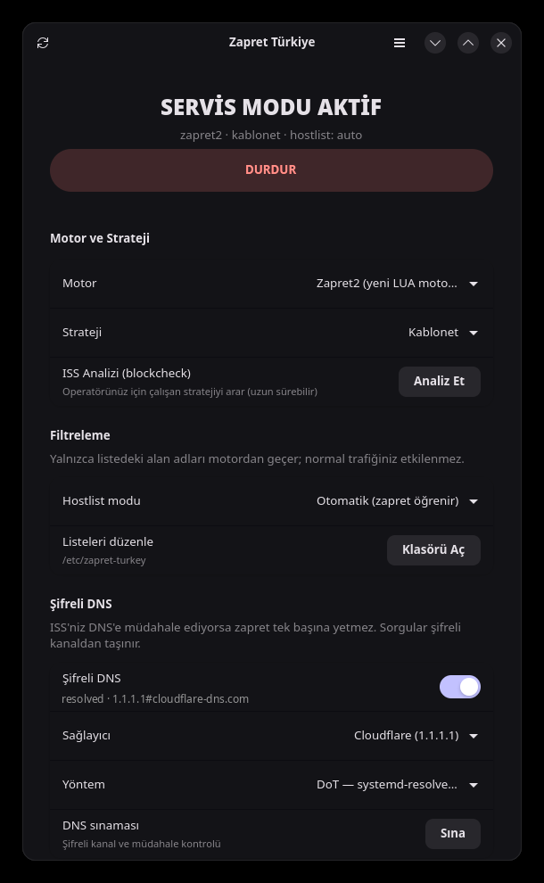
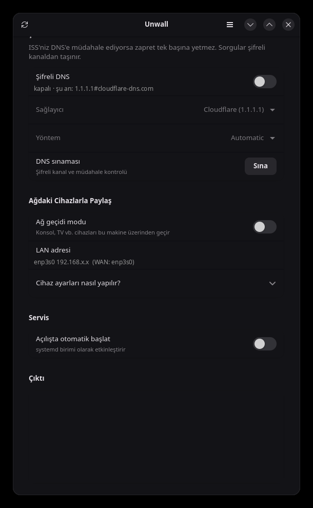

<p align="center">
  
</p>

<h1 align="center">Unwall</h1>

<p align="center">
  <a href="LICENSE"></a>
</p>

**Türkçe** · [English](README.md)

@bol-van'ın DPI (Deep Packet Inspection) atlatma motorları
[zapret](https://github.com/bol-van/zapret) ve
[zapret2](https://github.com/bol-van/zapret2) için Linux kontrol paneli.
Unwall bu motorları masaüstünde gerçekten kullanılabilir hale getirir: systemd
servisi, nftables kuralları, şifreli DNS, konsollar için ağ geçidi modu ve hiçbir
zaman root olarak çalışmayan bir GTK4 arayüzü.

<p align="center">
  
  
</p>

Linux'ta motor yerli çalışır: WinDivert benzeri bir sürücü yerine çekirdeğin
**netfilter/NFQUEUE** altyapısı paketleri yakalar, işi `nfqws` yapar. Unwall bu
motorun etrafına operatör presetleri, hostlist yönetimi, şifreli DNS ve teşhis
araçları ekler.

Şu an hazır operatör presetleri **Türkiye** içindir (proje
[zapret-win-turkey](https://github.com/alimali54/zapret-win-turkey)
uygulamasından doğdu); başka bir ülke eklemek
[`lib/strategies.conf`](lib/strategies.conf) dosyasına tek satır eklemekten
ibarettir.

## Özellikler

- **Çoklu motor**: klasik `nfqws` (zapret) ve yeni LUA tabanlı `nfqws2` (zapret2).
- **Hazır stratejiler**: operatör presetleri (şimdilik `TR ·` Türk Telekom,
  Superonline, Kablonet, Vodafone, Turkcell/Telekom mobil) ve operatörden
  bağımsız genel profiller — blockcheck beklemeden denenebilir.
- **Blockcheck**: operatörünüz için çalışan stratejiyi otomatik arar, sonucu
  doğrudan yapılandırmaya yazar.
- **Hostlist / excludelist**: yalnızca engellenen alan adları motordan geçer;
  normal trafiğiniz etkilenmez. `com.tr` ve `gov.tr` varsayılan olarak hariç.
- **systemd servisi**: açılışta otomatik başlatma, arayüz açık olmasa da çalışır.
- **Ağ geçidi modu**: konsol, akıllı TV gibi cihazların trafiğini bu makine
  üzerinden geçirir (Windows'taki `go-pcap2socks` + Npcap katmanının karşılığı).
- **Şifreli DNS**: tek anahtarla DoH (`dnscrypt-proxy`, 443) veya DoT
  (`systemd-resolved`, 853) kurulumu — Windows sürümündeki YogaDNS önerisinin
  yerine geçer, geri alınabilir.
- **Teşhis**: DNS müdahalesi kontrolü, çakışan araç/kuyruk tespiti.
- **Türkçe ve İngilizce**: arayüz dili yerel ayardan seçilir, menüden
  (Dil) değiştirilebilir; `UW_LANG=tr` / `UW_LANG=en` ile de zorlanabilir.
- **Yetki ayrımı**: arayüz normal kullanıcı olarak çalışır, ayrıcalıklı işler
  polkit üzerinden tek bir yardımcı betiğe gider.

## Kurulum

```bash
./install.sh
```

Betik kendini bir kez yükseltir (`sudo`, yoksa `pkexec`), yani parola yalnızca
bir defa sorulur. Bu tek komut her şeyi yapar:

1. Dağıtımınızı tanır (`pacman` / `apt` / `dnf` / `zypper`) ve **gerekli +
   isteğe bağlı tüm paketleri kurar** (`dnscrypt-proxy` dahil)
2. Dosyaları, systemd birimini, polkit politikasını, ikonu ve uygulama menüsü
   girdisini yerleştirir
3. `nfqws` ve `nfqws2` motorlarını kaynaktan derler

Kurulum **hiçbir servisi başlatmaz ve hiçbir sistem ayarını değiştirmez**.
DNS, otomatik başlatma, strateji seçimi, ağ geçidi — hepsi arayüzden yapılır.

Seçenekler: `--yes` (soru sorma), `--no-deps`, `--no-build`, `PREFIX=/usr`.

Kurulumdan sonra uygulama menüsünde **Unwall** (Ağ kategorisi) belirir;
oradan ya da `unwall` komutuyla açabilirsiniz.

### Dağıtım paketleri

| Dağıtım | Komut |
|---|---|
| Arch / CachyOS | `cd packaging && makepkg -si` |
| Debian / Ubuntu | `./packaging/build-deb.sh && sudo apt install ./packaging/unwall_*.deb` |
| Fedora / openSUSE | `./packaging/build-rpm.sh && sudo dnf install ./packaging/RPMS/*.rpm` |
| Flatpak (yalnızca arayüz) | bkz. [`flatpak/README.md`](flatpak/README.md) |
| AppImage (yalnızca arayüz) | `./packaging/build-appimage.sh` |

`.deb` ve `.rpm` derleme betikleri sırasıyla `dpkg-dev` ve `rpm-build`
(`rpmbuild`) gerektirir; bu depodan gerçek bir paket üretirler, hazır bir
şey indirmezler. İki paket de tıpkı `install.sh` gibi davranır: siz
arayüzden ya da `unwallctl` ile yapmadıkça hiçbir servis başlamaz, hiçbir
sistem ayarına dokunulmaz.

Flatpak ve AppImage ayrı bir durum: ikisi de yalnızca GTK4 arayüzünü
içerebilir, nftables/systemd/NFQUEUE kısmını değil; bu yüzden host'ta
yukarıdaki paketlerden biri (ya da `install.sh`) zaten kurulu olmalı.

- **Flatpak** sandbox'lıdır; host'un `unwallctl`/`pkexec`'ine
  `flatpak-spawn --host` ile ulaşır. Nedenini ve nasıl çalıştığını
  [`flatpak/README.md`](flatpak/README.md) dosyasında bulabilirsiniz.
- **AppImage** sandbox'lı *değildir* — normal kullanıcı yetkinizle, diğer
  ikili dosyalar gibi çalışır; `unwallctl`/`pkexec`'i doğrudan çağırır,
  köprüye gerek yoktur. `appimagetool` gerektirir
  (`PATH`'inizde değilse `APPIMAGETOOL=/araç/yolu ./packaging/build-appimage.sh`);
  ortaya çıkan `Unwall-<sürüm>-x86_64.AppImage`, Flatpak gibi hâlâ
  çalıştığı makinede native motoru bekleyen, taşınabilir tek dosyalık bir
  arayüzdür.

**`zapret-turkey`'den yükseltme** (projenin eski adı): `./install.sh` yeterli.
Eski servisi kapatır, `/etc/zapret-turkey` ve `/opt/zapret-turkey` dizinlerini
yeni yollara taşır (motorlar yeniden derlenmez), şifreli DNS ayarınızı korur,
eski ikilileri, birimi, polkit politikasını ve menü girdisini siler.

Her şeyi kaldırmak için: `./uninstall.sh` (parolayı o da yalnızca bir kez
sorar). Servisi durdurup devre dışı
bırakır, nftables kurallarını siler, şifreli DNS yapılandırmasını geri alır
(değiştirdiği `dnscrypt-proxy.toml` varsa yedekten geri yükler), program
dosyalarını, ayarları ve listeleri, derlenmiş motorları ve kaynak ağacını,
günlükleri siler; sonunda geriye iz kalmadığını doğrular. `--yes` onay sormaz,
`--keep-config` `/etc/unwall` dizinini korur, `--purge-deps`
`dnscrypt-proxy` paketini de kaldırır. Diğer bağımlılıklar (nftables, gtk4,
luajit …) başka yazılımlar kullanabileceği için sistemde bırakılır.

<details>
<summary>Bağımlılıkları elle kurmak isterseniz</summary>

```bash
sudo pacman -S --needed nftables python-gobject libadwaita gtk4 polkit bind gcc make pkgconf git curl luajit libnetfilter_queue libnfnetlink libmnl zlib dnscrypt-proxy
```

```bash
sudo apt install nftables python3-gi gir1.2-adw-1 gir1.2-gtk-4.0 policykit-1 dnsutils build-essential pkg-config git curl libluajit-5.1-dev libnetfilter-queue-dev libnfnetlink-dev libmnl-dev zlib1g-dev dnscrypt-proxy
```

```bash
sudo dnf install nftables python3-gobject libadwaita gtk4 polkit bind-utils gcc make pkgconf git curl luajit-devel libnetfilter_queue-devel libnfnetlink-devel libmnl-devel zlib-devel dnscrypt-proxy
```

</details>

`build` komutu `bol-van/zapret` ve `bol-van/zapret2` depolarını
`/opt/unwall/src` altına klonlayıp `nfqws` / `nfqws2` ikililerini derler;
sonradan `sudo unwallctl build` ile motorları güncelleyebilirsiniz.

## Kullanım

Grafik arayüzden motoru, stratejiyi ve hostlist modunu seçip **ZAPRET'İ BAŞLAT**
demeniz yeterli. Seçimleriniz siz düğmeye basana kadar uygulanmaz; o ana kadar
durum satırında `uygulanmadı → ...` şeklinde görünür ve düğme
**AYARLARI UYGULA** olur. "Açılışta otomatik başlat" anahtarı systemd birimini
etkinleştirir; arayüz kapalıyken de çalışmaya devam eder.

Arayüz normal kullanıcı olarak çalışır; yalnızca yetki gerektiren işlemler
(başlatma, servis, DNS, ağ kuralları) polkit üzerinden parola sorar.

Terminalden:

```bash
sudo unwallctl start STRATEGY=superonline ENGINE=zapret2
```

| Komut | İş |
|---|---|
| `unwallctl status` | durum (key=value) |
| `unwallctl strategies [motor]` | hazır strateji listesi |
| `unwallctl config get\|set` | ayarları oku / yaz |
| `sudo unwallctl start\|stop\|restart` | motoru çalıştır / durdur |
| `sudo unwallctl enable\|disable` | açılışta otomatik başlatma |
| `sudo unwallctl blockcheck [motor]` | ISS analizi |
| `unwallctl dnscheck [domain]` | DNS müdahalesi kontrolü |
| `sudo unwallctl dns enable\|disable` | şifreli DNS (DoT/DoH) aç / kapat |
| `unwallctl dns status\|test` | şifreli DNS durumu / sınaması |
| `unwallctl doctor` | ortam / çakışma teşhisi |
| `sudo unwallctl disable-conflicts` | çakışan DPI araçlarını kapat |
| `unwallctl print-cmd`, `print-nft` | üretilen komutu ve kuralları göster |
| `unwallctl update-check` | GitHub'da yeni sürüm var mı bak (key=value) |

Ayar dosyası: `/etc/unwall/unwall.conf`
Listeler: `/etc/unwall/{hostlist,excludelist,autohostlist}.txt`
Günlükler: `journalctl -u unwall -f` ve `/var/log/unwall/`

Arayüz günde bir kez arka planda GitHub'da yeni sürüm olup olmadığına bakar
(aksi halde hiç ağa çıkmaz) ve bulursa kapatılabilir bir bant içinde sürüm
bağlantısını gösterir. Menüden (**Güncellemeleri denetle**) ya da terminalden
elle tetiklenebilir:

```bash
unwallctl update-check
```

## Şifreli DNS (YogaDNS karşılığı)

ISS'niz DNS'e müdahale ediyorsa zapret tek başına yetmez. Arayüzdeki **Şifreli
DNS** anahtarı ya da `unwallctl dns` komutu bunu kurar; elle dosya
düzenlemenize gerek yoktur.

İki yöntem var:

| Yöntem | Taşıma | Not |
|---|---|---|
| **DoH** — `dnscrypt-proxy` | 443/tcp | Normal HTTPS'ten ayırt edilemez, engellenmesi zor. `dnscrypt-proxy` paketi gerekir. |
| **DoT** — `systemd-resolved` | 853/tcp | Ek paket gerektirmez, ama 853 ayrı bir port olduğu için bazı ISS'ler kapatabilir. |

```bash
sudo unwallctl dns enable cloudflare auto
```

`auto`, `dnscrypt-proxy` kuruluysa DoH'u, değilse DoT'u seçer. Sağlayıcı olarak
`cloudflare`, `google` veya `quad9` verilebilir.

```bash
unwallctl dns test
sudo unwallctl dns disable
```

Ne yapıldığı:

- **DoT**: `/etc/systemd/resolved.conf.d/90-unwall.conf` içine
  `DNSOverTLS=yes` + sağlayıcı sunucuları yazılır. `Domains=~.` sayesinde
  DHCP ile gelen ISS DNS'i yerine bunlar kullanılır; kendi arama alanı olan
  bağlantılar (VPN, Tailscale) etkilenmez.
- **DoH**: `dnscrypt-proxy` `127.0.0.1:5300`'de DoH istemcisi olarak çalışır,
  `systemd-resolved` upstream olarak oraya bakar. Mevcut
  `dnscrypt-proxy.toml` üzerine yazmadan önce `.unwall.bak` olarak
  yedeklenir; `dns disable` yedeği geri yükler.

`dns disable` her iki değişikliği de geri alır — kaldırma betiği de bunu çağırır.

DoH için paket: `sudo pacman -S dnscrypt-proxy`

## Ağdaki Cihazlarla Paylaş (konsol, TV)

Arayüzdeki **Ağ geçidi modu** anahtarını açın. Bu makine yerel ağ için NAT yapan
bir yönlendiriciye dönüşür (`ip_forward` + `nft masquerade`) ve yönlendirilen
trafik de zapret'ten geçer. Windows'taki Npcap + `go-pcap2socks` katmanına gerek
yoktur; yönlendirme çekirdek tarafından yapılır.

DNS de Windows sürümündeki `go-pcap2socks`'un yaptığı işi görür, sadece gömülü
bir proxy yerine bir nftables kuralıyla: LAN'dan gelen her DNS sorgusu (TCP ve
UDP, port 53) bu makinenin **kendi kullandığı çözümleyiciye** (şifreli DNS
açıksa ona dahil) şeffafça yönlendirilir. **Cihazın DNS alanına ne yazdığınızın
önemi yoktur** — ISS'niz port 53'ü engelliyorsa zaten bu özellik tam da bunun
için var: cihazın paketleri o adrese hiç gerçekten çıkmaz, çıkmadan önce bu
makineye yeniden yazılır.

Cihazın (PlayStation, Xbox, Switch, TV) manuel ağ ayarlarına:

- **IP adresi**: ağınızda boş bir adres (örn. `192.168.1.50`)
- **Alt ağ maskesi**: ağınızla aynı (genelde `255.255.255.0`)
- **Ağ geçidi**: bu bilgisayarın LAN IP adresi (arayüzde "LAN adresi" satırında yazar)
- **DNS**: geçerli görünen herhangi bir değer olur (örn. `1.1.1.1`) — çoğu
  cihaz DNS alanı boşken devam etmiyor, ama gerçek değer yukarıdaki
  yönlendirmeyle zaten geçersiz kılınıyor

Not: `firewalld`/`ufw` gibi bir güvenlik duvarı `forward` zincirinde varsayılan
olarak paket düşürüyorsa yönlendirmeye izin vermeniz gerekir.

## Windows sürümünden farklar

| Windows | Linux karşılığı |
|---|---|
| `winws.exe` / `winws2.exe` | `nfqws` / `nfqws2` |
| WinDivert sürücüsü | netfilter NFQUEUE (`nfnetlink_queue`) |
| `--wf-tcp` / `--wf-udp` / `--wf-l3` | nftables kuralları (`queue num ... bypass`) |
| `sc create ZapretService` | `unwall.service` (systemd) |
| UAC / `#RequireAdmin` | polkit + `pkexec` (yalnızca yardımcı betik yükselir) |
| Npcap + `go-pcap2socks` | `ip_forward` + `nft masquerade` |
| YogaDNS (elle kurulur) | `dns enable` ile tümleşik DoH/DoT (`dnscrypt-proxy` / `systemd-resolved`) |
| `nslookup`, `ipconfig /flushdns` | `dig`, `resolvectl flush-caches` |
| GoodbyeDPI çakışma kontrolü | `nfqws`/`tpws`/`byedpi`/TUN ve kuyruk çakışması (`doctor`) |
| `config.ini` | `/etc/unwall/unwall.conf` |
| AutoIt GUI | GTK4 + libadwaita (Python) |

Strateji parametreleri (`--dpi-desync=…`, `--lua-desync=…`, `--hostlist…`) her iki
platformda aynıdır; yalnızca trafiği motora yönlendirme katmanı değişir.

## Proje yapısı

```
bin/unwallctl          ayrıcalıklı işlerin tamamı (CLI + polkit hedefi)
bin/unwall             GUI başlatıcı
gui/unwall_gui.py      GTK4 / libadwaita arayüzü (host-farkında: Flatpak'tan da çalışır)
lib/strategies.conf    hazır strateji profilleri
etc/unwall.conf        varsayılan yapılandırma
systemd/unwall.service systemd birimi
polkit/…policy         yetki yükseltme politikası
packaging/PKGBUILD     Arch paketi
packaging/debian/      .deb kontrol dosyaları (bkz. build-deb.sh)
packaging/unwall.spec  Fedora/openSUSE .rpm spec (bkz. build-rpm.sh)
flatpak/                Arayüz için Flatpak manifesti (bkz. flatpak/README.md)
packaging/appimage/     AppImage için AppRun (bkz. build-appimage.sh)
docs/screenshots/      arayüz görselleri
```

## Sorun giderme

```bash
unwallctl doctor
```

Arayüzü terminalden çalıştırırsanız her şey konsola akar; ayrıntı için:

```bash
UW_DEBUG=1 unwall
```

Uygulama tek örnekli çalışır: menüden açılmış bir pencere varken terminalden
başlatmak yalnızca o pencereyi öne getirir ve terminale log gelmez. Hata
ayıklarken ayrı bir örnek isterseniz:

```bash
UW_NO_UNIQUE=1 UW_DEBUG=1 unwall
```

- **Motor başlamıyor**: `journalctl -u unwall -n 50`
- **Seçtiğim strateji geri dönüyor**: seçim "AYARLARI UYGULA" / "ZAPRET'İ
  BAŞLAT" düğmesine basılana kadar yalnızca beklemededir; durum satırında
  `uygulanmadı → ...` şeklinde görünür.
- **Hiçbir şey değişmedi**: `sudo nft list table ip unwall` ile kuralların
  yüklendiğini doğrulayın; hostlist modu `manual` ise alan adının listede olduğundan
  emin olun.
- **QUIC/HTTP3 siteleri bozuldu**: config'te `PORTS_UDP=` (boş) yapın.
- **"Otomatik (zapret öğrenir)" hostlist modu yeni domain eklemiyor**: bir
  domain yalnızca *henüz desync edilmemişken* tanınabilir bir "bağlantı
  engellendi" örüntüsü (varsayılan: 60 saniyede 3 başarısızlık — TCP
  retransmit, ya da en az 4 giden/en fazla 1 gelen UDP paketi) görülürse
  eklenir. Stratejiniz zaten sorunsuz çalışıyorsa bu örüntü hiç oluşmaz ve
  domain haklı olarak eklenmez — bu bir hata değil, öğrenecek bir şey
  olmadığı anlamına gelir. Motorun gerçekte ne gördüğünü görmek için
  engellenen bir siteye girerken `sudo tail -f /var/log/unwall/hostlist-auto.log`
  komutunu izleyin.
- **Başka bir DPI aracı çalışıyor**: `byedpi`, `tpws`, upstream `zapret.service`
  veya TUN kuran bir VPN aynı anda açıksa kuyruk çakışır.
- **Sistemde zaten upstream zapret kurulu** (`/opt/zapret`, `zapret.service`):
  ikisini aynı anda çalıştırmayın — `sudo systemctl disable --now zapret`.
  Bu projenin varsayılan kuyruk numarası çakışmayı azaltmak için `210`'dur
  (upstream `200` kullanır). Ayrıca `build` adımını atlayıp mevcut
  `/opt/zapret` ve `/opt/zapret2` ikilileri doğrudan kullanılabilir; motor
  bulunamazsa oralara da bakılır.

## Lisans

Unwall [GNU Genel Kamu Lisansı v3.0](LICENSE) ya da sonraki bir sürümü ile
lisanslanmıştır. Çalıştırmakta, incelemekte, paylaşmakta ve değiştirmekte
serbestsiniz; değiştirilmiş bir sürümü dağıtırsanız aynı lisans altında
kalmalı ve kaynak koduyla birlikte gelmelidir.

## Teşekkürler

- [@WinTone01](https://github.com/WinTone01) — Unwall'ı yazdı: Linux tarafının
  tamamı (`unwallctl`, systemd/nftables/polkit entegrasyonu, GTK4 arayüz,
  şifreli DNS, ağ geçidi modu, güncelleme denetleyicisi) ve projeyi sürdürüyor.
- Bu projenin temelini oluşturan Windows sürümü
  [zapret-win-turkey](https://github.com/alimali54/zapret-win-turkey) için
  geliştiricisi [@alimali54](https://github.com/alimali54)
- Zapret ve zapret2 motorları için [@bol-van](https://github.com/bol-van)
- Otomatik blockcheck mantığı ve ilhamı için
  [splitwire-turkey](https://github.com/cagritaskn/splitwire-turkey) geliştiricisi
  [@cagritaskn](https://github.com/cagritaskn)
- Windows sürümündeki LAN paylaşımı fikri için
  [go-pcap2socks](https://github.com/DaniilSokolyuk/go-pcap2socks) geliştiricisi
  [@DaniilSokolyuk](https://github.com/DaniilSokolyuk)
