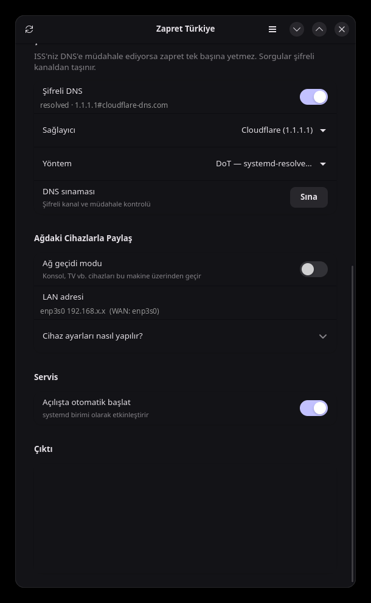

# Zapret Linux Türkiye

**Türkçe** · [English](README.md)

Türk kullanıcılar için DPI (Deep Packet Inspection) tabanlı internet sansürünü
atlatmaya yarayan [zapret](https://github.com/bol-van/zapret) ve
[zapret2](https://github.com/bol-van/zapret2) motorlarının Linux kontrol paneli.

<p align="center">
  
  
</p>

Bu proje, [zapret-win-turkey](https://github.com/alimali54/zapret-win-turkey)
(AutoIt + `zapret-win-bundle`) Windows uygulamasının Linux karşılığıdır.

Linux'ta motorun kendisi zaten yerli çalışır: WinDivert sürücüsü yerine çekirdeğin
**netfilter/NFQUEUE** altyapısı kullanılır, `winws.exe` yerine `nfqws` çalışır.
Bu proje o motorun etrafına Türkiye'ye özel stratejiler, hostlist yönetimi,
systemd servisi, şifreli DNS ve GTK4 arayüzü ekler.

## Özellikler

- **Çoklu motor**: klasik `nfqws` (zapret) ve yeni LUA tabanlı `nfqws2` (zapret2).
- **Hazır stratejiler**: Türk Telekom (+alternatif), Superonline (+alternatif),
  Kablonet, Vodafone, Turkcell/Telekom mobil ve operatörden bağımsız genel
  profiller — blockcheck beklemeden denenebilir. Kaynak: bu projenin Windows
  sürümü ve splitwire-turkey `presets.txt`.
- **Blockcheck**: operatörünüz için çalışan stratejiyi otomatik arar, sonucu
  doğrudan yapılandırmaya yazar.
- **Hostlist / excludelist**: yalnızca engellenen alan adları motordan geçer;
  normal trafiğiniz etkilenmez. `com.tr` ve `gov.tr` varsayılan olarak hariç.
- **systemd servisi**: açılışta otomatik başlatma, arayüz açık olmasa da çalışır.
- **Ağ geçidi modu**: konsol, akıllı TV gibi cihazların trafiğini bu makine
  üzerinden geçirir (Windows'taki `go-pcap2socks` + Npcap katmanının karşılığı).
- **Şifreli DNS**: tek anahtarla DoH (`dnscrypt-proxy`, 443) veya DoT
  (`systemd-resolved`, 853) kurulumu — Windows sürümündeki YogaDNS önerisinin
  yerine geçer, geri alınabilir.
- **Teşhis**: DNS müdahalesi kontrolü, çakışan araç/kuyruk tespiti.
- **Yetki ayrımı**: arayüz normal kullanıcı olarak çalışır, ayrıcalıklı işler
  polkit üzerinden tek bir yardımcı betiğe gider.

## Kurulum

```bash
./install.sh
```

Betik kendini bir kez yükseltir (`sudo`, yoksa `pkexec`), yani parola yalnızca
bir defa sorulur. Bu tek komut her şeyi yapar:

1. Dağıtımınızı tanır (`pacman` / `apt` / `dnf` / `zypper`) ve **gerekli +
   isteğe bağlı tüm paketleri kurar** (`dnscrypt-proxy` dahil)
2. Dosyaları, systemd birimini, polkit politikasını, ikonu ve uygulama menüsü
   girdisini yerleştirir
3. `nfqws` ve `nfqws2` motorlarını kaynaktan derler

Kurulum **hiçbir servisi başlatmaz ve hiçbir sistem ayarını değiştirmez**.
DNS, otomatik başlatma, strateji seçimi, ağ geçidi — hepsi arayüzden yapılır.

Seçenekler: `--yes` (soru sorma), `--no-deps`, `--no-build`, `PREFIX=/usr`.

Kurulumdan sonra uygulama menüsünde **Zapret Türkiye** (Ağ kategorisi) belirir;
oradan ya da `zapret-turkey` komutuyla açabilirsiniz.

Arch/CachyOS için paket olarak kurmak isterseniz: `cd packaging && makepkg -si`

Her şeyi kaldırmak için: `./uninstall.sh` (parolayı o da yalnızca bir kez
sorar). Servisi durdurup devre dışı
bırakır, nftables kurallarını siler, şifreli DNS yapılandırmasını geri alır
(değiştirdiği `dnscrypt-proxy.toml` varsa yedekten geri yükler), program
dosyalarını, ayarları ve listeleri, derlenmiş motorları ve kaynak ağacını,
günlükleri siler; sonunda geriye iz kalmadığını doğrular. `--yes` onay sormaz,
`--keep-config` `/etc/zapret-turkey` dizinini korur, `--purge-deps`
`dnscrypt-proxy` paketini de kaldırır. Diğer bağımlılıklar (nftables, gtk4,
luajit …) başka yazılımlar kullanabileceği için sistemde bırakılır.

<details>
<summary>Bağımlılıkları elle kurmak isterseniz</summary>

```bash
sudo pacman -S --needed nftables python-gobject libadwaita gtk4 polkit bind gcc make pkgconf git curl luajit libnetfilter_queue libnfnetlink libmnl zlib dnscrypt-proxy
```

```bash
sudo apt install nftables python3-gi gir1.2-adw-1 gir1.2-gtk-4.0 policykit-1 dnsutils build-essential pkg-config git curl libluajit-5.1-dev libnetfilter-queue-dev libnfnetlink-dev libmnl-dev zlib1g-dev dnscrypt-proxy
```

```bash
sudo dnf install nftables python3-gobject libadwaita gtk4 polkit bind-utils gcc make pkgconf git curl luajit-devel libnetfilter_queue-devel libnfnetlink-devel libmnl-devel zlib-devel dnscrypt-proxy
```

</details>

`build` komutu `bol-van/zapret` ve `bol-van/zapret2` depolarını
`/opt/zapret-turkey/src` altına klonlayıp `nfqws` / `nfqws2` ikililerini derler;
sonradan `sudo zapret-turkeyctl build` ile motorları güncelleyebilirsiniz.

## Kullanım

Grafik arayüzden motoru, stratejiyi ve hostlist modunu seçip **ZAPRET'İ BAŞLAT**
demeniz yeterli. Seçimleriniz siz düğmeye basana kadar uygulanmaz; o ana kadar
durum satırında `uygulanmadı → ...` şeklinde görünür ve düğme
**AYARLARI UYGULA** olur. "Açılışta otomatik başlat" anahtarı systemd birimini
etkinleştirir; arayüz kapalıyken de çalışmaya devam eder.

Arayüz normal kullanıcı olarak çalışır; yalnızca yetki gerektiren işlemler
(başlatma, servis, DNS, ağ kuralları) polkit üzerinden parola sorar.

Terminalden:

```bash
sudo zapret-turkeyctl start STRATEGY=superonline ENGINE=zapret2
```

| Komut | İş |
|---|---|
| `zapret-turkeyctl status` | durum (key=value) |
| `zapret-turkeyctl strategies [motor]` | hazır strateji listesi |
| `zapret-turkeyctl config get\|set` | ayarları oku / yaz |
| `sudo zapret-turkeyctl start\|stop\|restart` | motoru çalıştır / durdur |
| `sudo zapret-turkeyctl enable\|disable` | açılışta otomatik başlatma |
| `sudo zapret-turkeyctl blockcheck [motor]` | ISS analizi |
| `zapret-turkeyctl dnscheck [domain]` | DNS müdahalesi kontrolü |
| `sudo zapret-turkeyctl dns enable\|disable` | şifreli DNS (DoT/DoH) aç / kapat |
| `zapret-turkeyctl dns status\|test` | şifreli DNS durumu / sınaması |
| `zapret-turkeyctl doctor` | ortam / çakışma teşhisi |
| `sudo zapret-turkeyctl disable-conflicts` | çakışan DPI araçlarını kapat |
| `zapret-turkeyctl print-cmd`, `print-nft` | üretilen komutu ve kuralları göster |

Ayar dosyası: `/etc/zapret-turkey/zapret-turkey.conf`
Listeler: `/etc/zapret-turkey/{hostlist,excludelist,autohostlist}.txt`
Günlükler: `journalctl -u zapret-turkey -f` ve `/var/log/zapret-turkey/`

## Şifreli DNS (YogaDNS karşılığı)

ISS'niz DNS'e müdahale ediyorsa zapret tek başına yetmez. Arayüzdeki **Şifreli
DNS** anahtarı ya da `zapret-turkeyctl dns` komutu bunu kurar; elle dosya
düzenlemenize gerek yoktur.

İki yöntem var:

| Yöntem | Taşıma | Not |
|---|---|---|
| **DoH** — `dnscrypt-proxy` | 443/tcp | Normal HTTPS'ten ayırt edilemez, engellenmesi zor. `dnscrypt-proxy` paketi gerekir. |
| **DoT** — `systemd-resolved` | 853/tcp | Ek paket gerektirmez, ama 853 ayrı bir port olduğu için bazı ISS'ler kapatabilir. |

```bash
sudo zapret-turkeyctl dns enable cloudflare auto
```

`auto`, `dnscrypt-proxy` kuruluysa DoH'u, değilse DoT'u seçer. Sağlayıcı olarak
`cloudflare`, `google` veya `quad9` verilebilir.

```bash
zapret-turkeyctl dns test
sudo zapret-turkeyctl dns disable
```

Ne yapıldığı:

- **DoT**: `/etc/systemd/resolved.conf.d/90-zapret-turkey.conf` içine
  `DNSOverTLS=yes` + sağlayıcı sunucuları yazılır. `Domains=~.` sayesinde
  DHCP ile gelen ISS DNS'i yerine bunlar kullanılır; kendi arama alanı olan
  bağlantılar (VPN, Tailscale) etkilenmez.
- **DoH**: `dnscrypt-proxy` `127.0.0.1:5300`'de DoH istemcisi olarak çalışır,
  `systemd-resolved` upstream olarak oraya bakar. Mevcut
  `dnscrypt-proxy.toml` üzerine yazmadan önce `.zapret-turkey.bak` olarak
  yedeklenir; `dns disable` yedeği geri yükler.

`dns disable` her iki değişikliği de geri alır — kaldırma betiği de bunu çağırır.

DoH için paket: `sudo pacman -S dnscrypt-proxy`

## Ağdaki Cihazlarla Paylaş (konsol, TV)

Arayüzdeki **Ağ geçidi modu** anahtarını açın. Bu makine yerel ağ için NAT yapan
bir yönlendiriciye dönüşür (`ip_forward` + `nft masquerade`) ve yönlendirilen
trafik de zapret'ten geçer. Windows'taki Npcap + `go-pcap2socks` katmanına gerek
yoktur; yönlendirme çekirdek tarafından yapılır.

Cihazın (PlayStation, Xbox, Switch, TV) manuel ağ ayarlarına:

- **IP adresi**: ağınızda boş bir adres (örn. `192.168.1.50`)
- **Alt ağ maskesi**: ağınızla aynı (genelde `255.255.255.0`)
- **Ağ geçidi**: bu bilgisayarın LAN IP adresi (arayüzde "LAN adresi" satırında yazar)
- **DNS**: `1.1.1.1` / `8.8.8.8`

Not: `firewalld`/`ufw` gibi bir güvenlik duvarı `forward` zincirinde varsayılan
olarak paket düşürüyorsa yönlendirmeye izin vermeniz gerekir.

## Windows sürümünden farklar

| Windows | Linux karşılığı |
|---|---|
| `winws.exe` / `winws2.exe` | `nfqws` / `nfqws2` |
| WinDivert sürücüsü | netfilter NFQUEUE (`nfnetlink_queue`) |
| `--wf-tcp` / `--wf-udp` / `--wf-l3` | nftables kuralları (`queue num ... bypass`) |
| `sc create ZapretService` | `zapret-turkey.service` (systemd) |
| UAC / `#RequireAdmin` | polkit + `pkexec` (yalnızca yardımcı betik yükselir) |
| Npcap + `go-pcap2socks` | `ip_forward` + `nft masquerade` |
| YogaDNS (elle kurulur) | `dns enable` ile tümleşik DoH/DoT (`dnscrypt-proxy` / `systemd-resolved`) |
| `nslookup`, `ipconfig /flushdns` | `dig`, `resolvectl flush-caches` |
| GoodbyeDPI çakışma kontrolü | `nfqws`/`tpws`/`byedpi`/TUN ve kuyruk çakışması (`doctor`) |
| `config.ini` | `/etc/zapret-turkey/zapret-turkey.conf` |
| AutoIt GUI | GTK4 + libadwaita (Python) |

Strateji parametreleri (`--dpi-desync=…`, `--lua-desync=…`, `--hostlist…`) her iki
platformda aynıdır; yalnızca trafiği motora yönlendirme katmanı değişir.

## Proje yapısı

```
bin/zapret-turkeyctl          ayrıcalıklı işlerin tamamı (CLI + polkit hedefi)
bin/zapret-turkey             GUI başlatıcı
gui/zapret_turkey_gui.py      GTK4 / libadwaita arayüzü
lib/strategies.conf           hazır strateji profilleri
etc/zapret-turkey.conf        varsayılan yapılandırma
systemd/zapret-turkey.service systemd birimi
polkit/…policy                yetki yükseltme politikası
packaging/PKGBUILD            Arch paketi
docs/screenshots/             arayüz görselleri
```

## Sorun giderme

```bash
zapret-turkeyctl doctor
```

Arayüzü terminalden çalıştırırsanız her şey konsola akar; ayrıntı için:

```bash
ZT_DEBUG=1 zapret-turkey
```

Uygulama tek örnekli çalışır: menüden açılmış bir pencere varken terminalden
başlatmak yalnızca o pencereyi öne getirir ve terminale log gelmez. Hata
ayıklarken ayrı bir örnek isterseniz:

```bash
ZT_NO_UNIQUE=1 ZT_DEBUG=1 zapret-turkey
```

- **Motor başlamıyor**: `journalctl -u zapret-turkey -n 50`
- **Seçtiğim strateji geri dönüyor**: seçim "AYARLARI UYGULA" / "ZAPRET'İ
  BAŞLAT" düğmesine basılana kadar yalnızca beklemededir; durum satırında
  `uygulanmadı → ...` şeklinde görünür.
- **Hiçbir şey değişmedi**: `sudo nft list table ip zapret_turkey` ile kuralların
  yüklendiğini doğrulayın; hostlist modu `manual` ise alan adının listede olduğundan
  emin olun.
- **QUIC/HTTP3 siteleri bozuldu**: config'te `PORTS_UDP=` (boş) yapın.
- **Başka bir DPI aracı çalışıyor**: `byedpi`, `tpws`, upstream `zapret.service`
  veya TUN kuran bir VPN aynı anda açıksa kuyruk çakışır.
- **Sistemde zaten upstream zapret kurulu** (`/opt/zapret`, `zapret.service`):
  ikisini aynı anda çalıştırmayın — `sudo systemctl disable --now zapret`.
  Bu projenin varsayılan kuyruk numarası çakışmayı azaltmak için `210`'dur
  (upstream `200` kullanır). Ayrıca `build` adımını atlayıp mevcut
  `/opt/zapret` ve `/opt/zapret2` ikilileri doğrudan kullanılabilir; motor
  bulunamazsa oralara da bakılır.

## Teşekkürler

- Bu projenin temelini oluşturan Windows sürümü
  [zapret-win-turkey](https://github.com/alimali54/zapret-win-turkey) için
  geliştiricisi [@alimali54](https://github.com/alimali54)
- Zapret ve zapret2 motorları için [@bol-van](https://github.com/bol-van)
- Otomatik blockcheck mantığı ve ilhamı için
  [splitwire-turkey](https://github.com/cagritaskn/splitwire-turkey) geliştiricisi
  [@cagritaskn](https://github.com/cagritaskn)
- Windows sürümündeki LAN paylaşımı fikri için
  [go-pcap2socks](https://github.com/DaniilSokolyuk/go-pcap2socks) geliştiricisi
  [@DaniilSokolyuk](https://github.com/DaniilSokolyuk)
