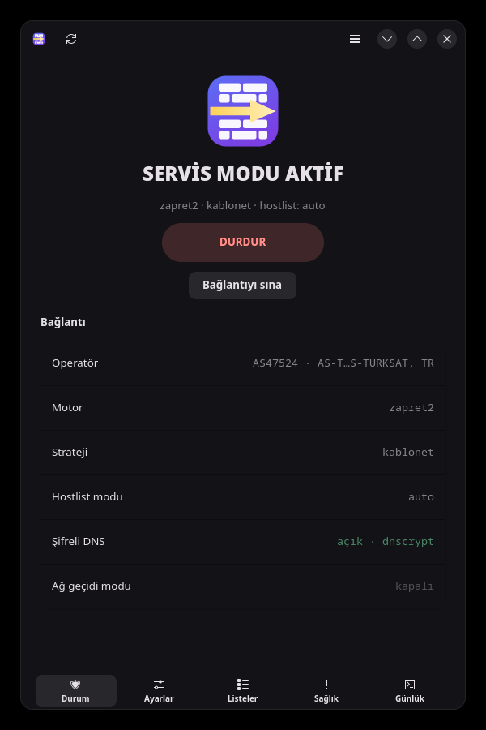
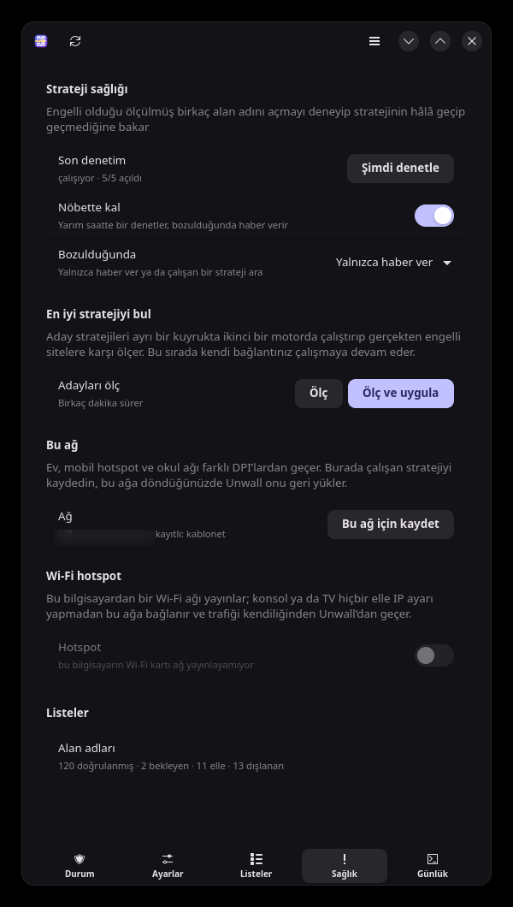
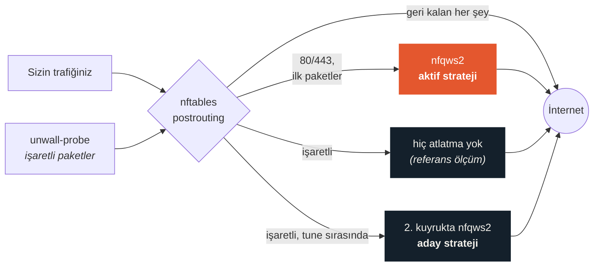

<p align="center">
  
</p>

<h1 align="center">Unwall</h1>

<p align="center">
  <b><code>zapret</code> / <code>zapret2</code> DPI atlatma motorları için Linux kontrol paneli.</b><br>
  systemd servisi, nftables kuralları, şifreli DNS, ağ geçidi modu — ve hiçbir zaman root çalışmayan bir GTK4 arayüzü.
</p>

<p align="center">
  <a href="https://github.com/WinTone01/Unwall/releases/latest"></a>
  <a href="LICENSE"></a>
  <a href="https://github.com/WinTone01/Unwall/actions/workflows/ci.yml"></a>
  
</p>

<p align="center">
  <a href="README.md">English</a> · <b>Türkçe</b>
</p>

<p align="center">
  
  
</p>

<p align="center">
  <sub><b>Durum</b> — şu an ne çalışıyor · <b>Sağlık</b> — hâlâ çalışıyor mu, daha iyisi mümkün mü</sub>
</p>

---

## Bu nedir

[@bol-van](https://github.com/bol-van)'ın **zapret** ve **zapret2** motorları
kendi işlerinde çok iyi ve tamamen komut satırına dayalı: elle yazılan nftables
kuralları, systemd birimi, tek tek denenecek onlarca parametre. Unwall bunları
kurulup tıklanan ve sonra unutulabilen bir şeye çeviriyor — operatör presetleri,
şifreli DNS, yerel ağ paylaşımı ve bir GTK4 arayüzü; üstelik o arayüz hiçbir
zaman root çalışmadan.

Linux'ta motor yerli çalışıyor. WinDivert benzeri bir sürücü yerine çekirdeğin
kendi **netfilter/NFQUEUE** altyapısı paketleri `nfqws`'e veriyor: ek sürücü yok,
TUN aygıtı yok, sizinle ağ yığını arasında hiçbir şey yok.

**v2.0'dan beri** Unwall yalnızca bir strateji uygulamıyor; o stratejinin işe
yarayıp yaramadığını ölçüyor ve yaramıyorsa bunu söylüyor.

## Nasıl çalışır

Makineden çıkan her paket nftables kurallarından geçiyor. Motora yalnızca
ayarlanan portlardaki — varsayılan olarak 80/443, ayrıca UDP üzerinden QUIC ve
Discord sesli sohbet — bağlantıların ilk birkaç paketi veriliyor; geri kalan her
şey doğrudan dışarı çıkıyor.


```mermaid
flowchart LR
    U["Sizin trafiğiniz"] --> Q{"nftables<br/>postrouting"}
    P["unwall-probe<br/><i>işaretli paketler</i>"] --> Q

    Q -- "80/443,<br/>ilk paketler" --> E["nfqws2<br/><b>aktif strateji</b>"]
    Q -- "geri kalan her şey" --> I(("İnternet"))
    Q -- "işaretli" --> N["hiç atlatma yok<br/><i>(referans ölçüm)</i>"]
    Q -- "işaretli, tune sırasında" --> T["2. kuyrukta nfqws2<br/><b>aday strateji</b>"]

    E --> I
    N --> I
    T --> I

    classDef accent fill:#E4572E,stroke:none,color:#ffffff
    classDef ink fill:#14202B,stroke:none,color:#F2F0EA
    class E accent
    class N,T ink
```

O işaretli yol, v2.0'ın bütün hilesi. Ayrılmış, yetkisiz bir kullanıcının
(`unwall-probe`) paketleri motorun kendi fwmark'ıyla damgalanıyor ve kuyruk
kuralları zaten işaretli paketleri almıyor — böylece Unwall aynı siteyi
atlatma **ile** ve atlatma **olmadan**, ya da ikinci bir kuyruktaki aday
strateji üzerinden açabiliyor; tek bir kurala dokunmadan ve sizin yaptığınız işi
kesmeden.

## Özellikler

|  |  |
|---|---|
| 🎛️ **Hazır stratejiler** | Operatör presetleri (`TR ·` Türk Telekom, Superonline, Kablonet, Vodafone, Turkcell / Telekom Mobil) ve operatörden bağımsız profiller — blockcheck çalıştırmadan kullanılabilir |
| 🔍 **Blockcheck ve operatör tespiti** | ISS'nizde çalışan stratejiyi arar; ya da ASN'nizi şifreli DNS üzerinden sorup uygun profili seçer |
| 📊 **Doğrulanmış listeler** | Bir alan adı, ancak siteye atlatmayla ve atlatmasız erişim arasındaki fark ölçüldükten sonra listede kalır |
| 🎯 **Auto-tune** | Aday stratejileri gerçekten engelli sitelere karşı, ayrı bir kuyrukta puanlar; siz gezmeye devam edersiniz |
| 🔔 **Nöbetçi** | Yarım saatte bir stratejinin hâlâ geçip geçmediğine bakar, gerekirse kendisi yenisini arar |
| 📍 **Ağ başına profil** | Ev, mobil hotspot ve okul ağı; her biri kendinde çalışan stratejiyi saklar |
| 🔐 **Şifreli DNS** | Tek anahtarla DoH (`dnscrypt-proxy`, 443) ya da DoT (`systemd-resolved`, 853); tamamen geri alınabilir |
| 📺 **Ağ geçidi modu** | Konsol ya da akıllı TV'yi, DNS'i dahil, bu makine üzerinden geçirir |
| 📡 **Hotspot modu** | Bu makineden Wi-Fi yayınlar; konsol hiçbir elle IP ayarı yapmadan bağlanır |
| ⚙️ **systemd servisi** | Açılışta başlar, arayüz kapalıyken de çalışmaya devam eder |
| 🌍 **Türkçe ve İngilizce** | Yerel ayarınızı izler, menüden değiştirilebilir (`UW_LANG=tr`/`en`) |
| 🛡️ **Yetki ayrımı** | Arayüz normal kullanıcı olarak çalışır; yetki gerektiren her iş polkit üzerinden tek bir betiğe gider |

## Hızlı başlangıç

```bash
git clone https://github.com/WinTone01/Unwall.git
cd Unwall && ./install.sh
```

Kurulum parolanızı bir kez sorar, dağıtımınıza göre bağımlılıkları kurar ve iki
motoru derler. **Hiçbir servisi başlatmaz, hiçbir sistem ayarına dokunmaz** —
gerisi arayüzden yapılır.

Ardından uygulama menüsünden (Ağ / İnternet kategorisi) ya da `unwall` komutuyla
**Unwall**'ı açın ve:

1. **Ayarlar → Motor ve Strateji** altından operatörünüzü seçin ya da
   **Analiz Et**'e basıp aratın.
2. **BAŞLAT**'a basın.
3. Önerilir — ISS'niz DNS'e müdahale ediyorsa **Şifreli DNS**'i, **Ayarlar →
   Servis** altından da **açılışta başlat**'ı açın.

Terminali tercih ederseniz:

```bash
sudo unwallctl start STRATEGY=superonline ENGINE=zapret2
unwallctl status
```

## Kurulum

### Dağıtım paketleri

| Dağıtım | Komut |
|---|---|
| Arch / CachyOS | `cd packaging && makepkg -si` |
| Debian / Ubuntu | `./packaging/build-deb.sh && sudo apt install ./packaging/unwall_*.deb` |
| Fedora / openSUSE | `./packaging/build-rpm.sh && sudo dnf install ./packaging/RPMS/*.rpm` |
| Flatpak (yalnızca arayüz) | bkz. [`flatpak/README.md`](flatpak/README.md) |
| AppImage (yalnızca arayüz) | `./packaging/build-appimage.sh` |

Hazır `.deb`, `.rpm`, AppImage ve Flatpak dosyaları her
[sürümün](https://github.com/WinTone01/Unwall/releases/latest) ekinde bulunur.

Derleme betikleri bu depodan gerçek bir paket üretir — hiçbir hazır dosya
indirmezler — ve `install.sh` ile birebir aynı davranırlar: siz yapmadan hiçbir
servis başlatılmaz, hiçbir sistem ayarına dokunulmaz.

Flatpak ve AppImage ayrı bir durum. İkisi de yalnızca GTK4 arayüzünü
içerebiliyor; nftables/systemd/NFQUEUE tarafını değil. Bu yüzden host'ta yine
yukarıdaki paketlerden biri (ya da `install.sh`) kurulu olmalı. Flatpak
sandbox'lıdır ve host'taki `unwallctl`/`pkexec`'e `flatpak-spawn --host` ile
ulaşır; AppImage sandbox'lı değildir, onları doğrudan çağırır.

<details>
<summary><b>Kurulum seçenekleri ve bağımlılıkların elle kurulumu</b></summary>
<br>

`./install.sh` şu seçenekleri alır: `--yes` (soru sormaz), `--no-deps`,
`--no-build`, `PREFIX=/usr`. Kendini bir kez yükseltir; `sudo` yoksa `pkexec`
kullanır.

```bash
# Arch
sudo pacman -S --needed nftables python-gobject libadwaita gtk4 polkit bind gcc make pkgconf git curl luajit libnetfilter_queue libnfnetlink libmnl zlib dnscrypt-proxy

# Debian / Ubuntu
sudo apt install nftables python3-gi gir1.2-adw-1 gir1.2-gtk-4.0 policykit-1 dnsutils build-essential pkg-config git curl libluajit-5.1-dev libnetfilter-queue-dev libnfnetlink-dev libmnl-dev zlib1g-dev dnscrypt-proxy

# Fedora / openSUSE
sudo dnf install nftables python3-gobject libadwaita gtk4 polkit bind-utils gcc make pkgconf git curl luajit-devel libnetfilter_queue-devel libnfnetlink-devel libmnl-devel zlib-devel dnscrypt-proxy
```

`sudo unwallctl build`, `bol-van/zapret` ve `bol-van/zapret2`'yi
`/opt/unwall/src` altına klonlayıp `nfqws` / `nfqws2` ikililerini derler.
Motorları güncellemek için sonradan tekrar çalıştırın.

</details>

<details>
<summary><b>Güncelleme ve kaldırma</b></summary>
<br>

```bash
sudo unwallctl self-update        # en son sürümü indirip kur
```

Arayüz, günde bir kez arka planda GitHub'da yeni sürüm olup olmadığına bakar —
kendiliğinden yaptığı tek ağ erişimi budur — ve bulursa kapatılabilir bir bant
gösterir. Oradaki **Şimdi güncelle** düğmesi (ya da yukarıdaki `self-update`) o
sürümün kaynak arşivini indirip üzerinde `install.sh --no-deps --no-build`
çalıştırır: CLI, arayüz, systemd birimi, polkit politikası, ikon ve menü girdisi
değişir; yapılandırmanız ve listeleriniz olduğu gibi kalır. Elle denetlemek için
`unwallctl update-check`.

**`zapret-turkey`'den geçiş** (projenin eski adı): sadece `./install.sh`
çalıştırın. Eski servisi kapatır, `/etc/zapret-turkey` ve `/opt/zapret-turkey`
dizinlerini yeni yollara taşır (motorlar yeniden derlenmesin diye), şifreli DNS
ayarınızı korur; eski ikilileri, birimi, polkit politikasını ve menü girdisini
siler.

**Kaldırmak için**: `./uninstall.sh` servisi durdurup devre dışı bırakır,
nftables kurallarını siler, şifreli DNS yapılandırmasını geri alır (değiştirdiği
`dnscrypt-proxy.toml` varsa geri yükler), program dosyalarını, ayarları,
listeleri, derlenmiş motorları ve günlükleri siler — sonra geride bir şey
kalmadığını doğrular. `--yes` onayı atlar, `--keep-config` `/etc/unwall`'ı
korur, `--purge-deps` `dnscrypt-proxy` paketini de kaldırır. Diğer bağımlılıklara
(nftables, gtk4, luajit …) dokunulmaz; başka yazılımlar da onlara ihtiyaç
duyabilir.

</details>

## Tahmin etmek yerine ölçmek

`HOSTLIST_MODE=auto` iken motor, engellenen alan adlarını kendisi öğrenir. Bu
tespit bir tahmindir: başarısız bir bağlantı, engellenmiş bir bağlantı demek
değildir. Anlık düşen bir site, kablosuz ağdaki bir sıçrama ya da hiç cevap
vermeyen bir telemetri ucu — hepsi aynı görünür. Bir test makinesinde
**öğrenilen 497 girdinin 368'i (%74) hiç engelli değildi**:
`ping.archlinux.org`, `connectivitycheck.gstatic.com`,
`incoming.telemetry.mozilla.org` ve onlar gibi uzun bir kuyruk. Bu sadece
gürültü de değil: engelli olmayan bir alan adına desync uygulamak o siteyi
bozabilir.

Bu yüzden öğrenilen alan adları artık doğrudan kalıcı listeye girmiyor.

1. **Karantina.** Yeni öğrenilenler `autohostlist-pending.txt`'ye yazılır.
   Strateji bu alan adlarına da uygulanır, yani beklerken hiçbir şey yavaşlamaz.
2. **Ölçüm.** `unwallctl verify` her alan adını iki kez açar — biri atlatmayla,
   biri atlatmasız — yukarıdaki şemadaki işaretli yol üzerinden.
3. **Karar.**

| Karar | Anlamı | Yapılan |
|---|---|---|
| `false-positive` | Atlatmasız da açılıyor | Silinir (karantinadan ikinci kez düşerse dışlama listesine de yazılır) |
| `blocked` | Atlatmasız kapalı, atlatmayla açık | Kalıcı listeye alınır |
| `still-blocked` | İki türlü de kapalı, imza DPI müdahalesi gibi | Listede kalır — **engel gerçek ama strateji onu geçemiyor** |
| `not-dpi` | Host canlı, sorun sertifika / TLS yapılandırması | Silinir (desync bunu çözmez) |
| `invalid` | Alan adı hiç çözülmüyor | Silinir |
| `unreachable` | Ölü host — 443'e çıplak TCP bile kurulamıyor | Silinir |

```bash
sudo unwallctl verify          # karantinadakileri doğrula
sudo unwallctl verify --all    # kalıcı listeyi de denetle
sudo unwallctl verify-timer on # saatte bir kendiliğinden yapsın
sudo unwallctl prune           # alan adı artık çözülmeyen girdileri ayıkla
```

Listeler değiştiği anda motor tarafından yeniden yüklenir; bunların hiçbiri bir
şeyi yeniden başlatmaz.

<details>
<summary><b>Engel, başka arızalardan nasıl ayırt ediliyor</b></summary>
<br>

Ayrım `curl`'ün çıkış koduna dayanıyor ve bunu doğru yapmak sanıldığından
önemli. Bir WebSocket ucu **HTTP 426** döndürüp akışı kapatıyor (curl 92), adıyla
eşleşmeyen sertifikası olan canlı bir host ise TLS'te düşüyor — ikisi de engel
değil, ama ikisi de engel sayılıyordu.

- Sunucudan **herhangi bir** HTTP kodu geldiği anda ölçüm başarılıdır; curl'ün
  çıkış kodunun ne olduğu önemli değil.
- TLS kesmeleri (`35/52/56`) müdahale imzası; sertifika hataları
  (`51/58/59/60/…`) ise TLS yapılandırması bozuk ama canlı bir host demek.
- Zaman aşımında karar çıplak bir TCP bağlantısıyla veriliyor: 443 açılıyorsa
  host canlıdır ve kesme el sıkışmada oluyordur.

`prune`, bir adın hâlâ var olup olmadığını 443/TLS üzerinden Cloudflare DoH'a
sorar — düz metin sorsaydı, DNS zehirlemesi olan bir ağda **bütün** alan adları
yok görünür ve liste silinirdi. DoH'a ulaşılamazsa hiçbir şey silinmez, ham IP
girdileri atlanır, `hostlist.txt` ve `excludelist.txt` ise hiç ellenmez: onlar
sizin.

</details>

### Daha iyi bir strateji bulmak

```bash
sudo unwallctl tune            # ölç ve öner
sudo unwallctl tune --apply    # ölç ve en iyisini uygula
sudo unwallctl tune --deep     # daha geniş parametre araması
```

`blockcheck`ten farkı, bağlantınızı hiç rahatsız etmemesi: aday, ayrı bir
kuyrukta (`QNUM+1`) ikinci bir motor örneğinde çalışır ve oraya yalnızca ölçüm
kullanıcısının trafiği gider.

Test kümesi de ölçülerek seçilir: doğrulanmış listenizden bir örneklem alınır ve
**mevcut stratejinin geçemediği** alan adlarına indirgenir; çünkü zaten çalışan
sitelere karşı puanlamak bütün adayları birbirinin aynı gösteriyor. Adaylar,
hazır profiller ile bir parametre ızgarasıdır (sahte paketin TTL'i, bölme
yöntemi) ve argümanlarına göre tekilleştirilir. Hepsini geçen bir aday bulununca
arama durur; mevcut strateji zaten hepsini geçiyorsa hiç aday denenmez.
Izgaradan çıkan bir kazanan `STRATEGY=analiz` + `CUSTOM_ARGS` olarak kaydedilir.

Hiçbir aday hedefleri geçemezse bunu açıkça söyler: engel muhtemelen IP
düzeyinde ya da el sıkışma sonrasındadır, ki ClientHello'yu bölmek bunu çözmez.

### Nöbetçi

```bash
sudo unwallctl watchdog            # şimdi ölç
sudo unwallctl watchdog-timer on   # yarım saatte bir ölç
```

Bir strateji, ISS DPI'ını güncellediğinde bir sabah çalışmayı bırakabilir ve bu
size "internet bozuldu" diye ulaşır. Nöbetçi, engelli olduğu *ölçülmüş* birkaç
alan adını açıp stratejinin hâlâ geçip geçmediğine bakar.

Yarısından azının açılması o ölçümü kötü yapar — ama `degraded` kararı **üst üste
iki kötü ölçüm** ister. Örneklem beş alan adı ve içlerinden biri o an kendi
arızasını yaşıyor olabilir: ölçüldü, dakikalar arayla yapılan iki denetim 5/5 ve
2/5 verdi. Tek bir şanssız denetimin stratejiyi değiştirmesi
(`WATCHDOG_ACTION=tune`) iyileştirme değil, gürültü olurdu.

### Ağ başına profil

```bash
unwallctl profile show     # bu ağın parmak izi ve kayıtlı profili
sudo unwallctl profile save
```

Ev, mobil hotspot ve okul ağı farklı DPI'lardan geçer. Motor, strateji ve
hostlist modu ağ başına hatırlanır — anahtar olarak önce Wi-Fi SSID'si, yoksa
varsayılan ağ geçidinin MAC adresi, o da yoksa router IP'si kullanılır — ve ağ
değiştiğinde bir NetworkManager kancası
(`/etc/NetworkManager/dispatcher.d/90-unwall`) profili geri yükler. Eskimiş bir
ARP girdisi, farklı bir anahtara düşmek yerine tek bir ping ile tazelenir: şekil
değiştiren bir parmak izi, sessizce hiç eşleşmeyen bir özellik demektir.

## Şifreli DNS

ISS'niz DNS'e müdahale ediyorsa zapret tek başına yetmez. Arayüzdeki **Şifreli
DNS** anahtarı ya da `unwallctl dns` komutu bunu sizin için kurar — elle dosya
düzenlemek yok.

| Yöntem | Taşıma | Notlar |
|---|---|---|
| **DoH** — `dnscrypt-proxy` | 443/tcp | Normal HTTPS'ten ayırt edilemez, engellemesi zor. `dnscrypt-proxy` paketi gerekir. |
| **DoT** — `systemd-resolved` | 853/tcp | Ek paket gerekmez, ama 853 ayrı bir porttur ve bazı ISS'ler kapatır. |

```bash
sudo unwallctl dns enable cloudflare auto   # auto = mümkünse DoH, değilse DoT
unwallctl dns test
sudo unwallctl dns disable
```

Sağlayıcılar: `cloudflare`, `google`, `quad9`.

<details>
<summary><b>Arka planda ne oluyor</b></summary>
<br>

- **DoT**: `/etc/systemd/resolved.conf.d/90-unwall.conf` altında `DNSOverTLS=yes`
  ve sağlayıcının sunucularını içeren bir drop-in. `Domains=~.` bunların
  DHCP'den gelen ISS sunucularına üstün gelmesini sağlar; kendi arama alan adı
  olan bağlantılar (VPN, Tailscale) etkilenmez.
- **DoH**: `dnscrypt-proxy`, `127.0.0.1:5300` üzerinde bir DoH istemcisi olarak
  çalışır ve `systemd-resolved` onu upstream olarak kullanır. Mevcut bir
  `dnscrypt-proxy.toml` değiştirilmeden önce `.unwall.bak` olarak yedeklenir;
  `dns disable` onu geri yükler.

`dns disable` iki değişikliği de geri alır — kaldırma betiği de onu çağırır.

</details>

## Konsol ya da TV ile paylaşmak

Başka bir cihazı Unwall'ın arkasına almanın iki yolu var.

### Hotspot — cihazda ayarlanacak hiçbir şey yok

```bash
sudo unwallctl hotspot on            # SSID "Unwall", parola üretilip yazdırılır
sudo unwallctl hotspot on EvAgi parolaniz
```

Kablosuz kartınız AP modunu destekliyorsa bu makine, NetworkManager'ın "shared"
modu üzerinden kendi Wi-Fi ağını yayınlar. Konsol ona sıradan bir ağa bağlanır
gibi bağlanır — IP yok, ağ geçidi alanı yok, DNS alanı yok — ve ağ geçidi
kuralları da onunla birlikte açılır. Kartınız aynı anda hem istemci hem erişim
noktası olamıyorsa ve internete de aynı karttan çıkıyorsanız bağlantı kopabilir;
komut bunu önceden uyarır.

### Ağ geçidi modu — cihazda elle ayar

Arayüzdeki **Ağ geçidi modu** anahtarını açın. Bu makine yerel ağ için NAT yapan
bir yönlendiriciye dönüşür (`ip_forward` + `nft masquerade`) ve yönlendirilen
trafik de zapret'ten geçer.

| Alan | Değer |
|---|---|
| IP adresi | ağınızda boş bir adres, örn. `192.168.1.50` |
| Alt ağ maskesi | ağınızla aynı, genelde `255.255.255.0` |
| Ağ geçidi | bu bilgisayarın LAN IP adresi (arayüzdeki "LAN adresi" satırı) |
| DNS | geçerli görünen herhangi bir değer, örn. `1.1.1.1` — gerçek değer geçersiz kılınır |

**Asıl önemli kısım DNS.** Bir nftables kuralı, LAN'dan gelen bütün DNS
sorgularını (TCP ve UDP, port 53) şeffafça bu makinedeki çözümleyiciye
yönlendirir; yani cihazın DNS ayarına ne yazdığınızın önemi yoktur. Port 53'e
giden *her* paketi ele geçirip kendi yanıtını döndüren ağlarda — Türk Telekom ve
TT Mobil bunu yapıyor — tek çözüm budur: konsolun kendi sorgusu ISS'ye ulaştığı
sürece engelli sitenin gerçek IP'sini asla öğrenemez ve DPI atlatma çalışsa bile
bağlantı yanlış adrese kurulur.

Yönlendirmenin hedefi otomatik seçilir: DoH açıksa dnscrypt-proxy'nin
`127.0.0.1:5300` adresi, değilse LAN adresinde açılan ayrı bir
`DNSStubListenerExtra` dinleyicisi. İkisi de kurulamıyorsa hiç yönlendirme
kuralı yazılmaz — cihazın kendi DNS'ini kullanması, kara deliğe düşmesinden
iyidir.

<details>
<summary><b>Güvenlik duvarı notları</b></summary>
<br>

Ağ geçidi modu iki güvenlik duvarı izni ister ve Unwall ikisini de kendisi
ekler:

- **Yönlendirme.** `ufw` ya da `firewalld`, `forward` zincirinde varsayılan
  olarak paket düşürüyorsa (birçok dağıtımda ufw'nin `DEFAULT_FORWARD_POLICY`
  ayarı kutudan çıktığı gibi `DROP`'tur) ağ geçidi modundaki cihazlar
  "bağlandım ama internet yok" yaşar. Ağ geçidi modu her uygulandığında hedefli
  bir `ufw route allow` kuralı (firewalld'de `firewall-cmd --add-forward`)
  eklenir.
- **Yönlendirilen sorgunun kendisi.** Yönlendirildikten sonra sorgunun hedefi bu
  makine olur ve paket `forward` değil `INPUT` zincirinden geçer; yani yukarıdaki
  kural onu kapsamaz. ufw'nin varsayılan gelen politikasıyla
  `[UFW BLOCK] … DST=127.0.0.1 DPT=5300` diye düşer. Yönlendirme hedefi için
  nokta atışı bir izin, kurallarla birlikte eklenip onlarla birlikte kaldırılır.

`unwallctl doctor` ikisini de "ağ geçidi yönlendirme" ve "ağ geçidi DNS"
satırlarında gösterir.

> [!NOTE]
> Ağ geçidi modunda cihazın IPv6'sı doğrudan router'dan gelir ve bu makineden
> hiç geçmez, yani Unwall'ı atlar. IPv6 üzerinden erişilebilen bir site
> engelliyse cihazda IPv6'yı kapatmak gerekir. Bu makinenin kendi IPv6 trafiği
> için `ENABLE_IPV6=1` yeterlidir.

</details>

## Komut satırı

```bash
unwallctl report      # tek komutta tüm durum — Sağlık sayfası bunu okur
unwallctl doctor      # ortam ve çakışma teşhisi
```

<details>
<summary><b>Bütün komutlar</b></summary>
<br>

| Komut | Ne yapar |
|---|---|
| `unwallctl status` | durum bilgisi (key=value) |
| `unwallctl report` | tek komutta tüm durum |
| `unwallctl strategies [motor]` | hazır strateji listesi |
| `unwallctl config get\|set` | ayarları oku / değiştir |
| `sudo unwallctl start\|stop\|restart` | motoru çalıştır / durdur |
| `sudo unwallctl enable\|disable` | açılışta başlat |
| `sudo unwallctl build [motor]` | motorları derle / güncelle |
| `sudo unwallctl blockcheck [motor]` | ISS analizi |
| `unwallctl blockcheck-results [motor]` | son blockcheck'teki tüm çalışan stratejiler |
| `unwallctl detect-isp` | operatörü ASN'den algıla, strateji öner |
| `unwallctl dnscheck [domain]` | DNS müdahalesi kontrolü |
| `unwallctl conncheck [domainler]` | birkaç hedefe gerçek TLS el sıkışması |
| `unwallctl hostlist show LİSTE` | listeyi yazdır (`manual`/`auto`/`pending`/`exclude`) |
| `sudo unwallctl hostlist add\|remove LİSTE ALAN` | alan adı ekle / sil |
| `sudo unwallctl verify [--all]` | öğrenilen alan adlarını ölçüp doğrula |
| `sudo unwallctl prune` | çözülmeyen alan adlarını listelerden ayıkla |
| `sudo unwallctl verify-timer on\|off` | düzenli doğrulama |
| `sudo unwallctl tune [--apply] [--deep]` | aday stratejileri ölç |
| `sudo unwallctl watchdog` | strateji hâlâ çalışıyor mu |
| `sudo unwallctl watchdog-timer on\|off` | düzenli sağlık denetimi |
| `unwallctl profile show\|list\|save\|apply` | ağ başına strateji profili |
| `sudo unwallctl hotspot status\|on\|off` | Wi-Fi ağı yayınla |
| `sudo unwallctl dns enable\|disable` | şifreli DNS (DoT/DoH) |
| `unwallctl dns status\|test` | şifreli DNS durumu / sınaması |
| `unwallctl gateway-info` | ağ geçidi modu bilgisi |
| `sudo unwallctl disable-conflicts` | çakışan DPI araçlarını kapat |
| `unwallctl print-cmd`, `print-nft` | üretilen komutu ve kuralları göster |
| `unwallctl update-check` | GitHub'da yeni sürüm var mı bak |
| `sudo unwallctl self-update [sürüm]` | bir sürümü indirip kur |

</details>

**Ayar dosyası**: `/etc/unwall/unwall.conf` ·
**Listeler**: `/etc/unwall/{hostlist,excludelist,autohostlist,autohostlist-pending}.txt` ·
**Günlükler**: `journalctl -u unwall -f` ve `/var/log/unwall/`

## Sorun giderme

```bash
unwallctl doctor
UW_DEBUG=1 unwall     # arayüzü terminalden, tam günlükle çalıştır
```

Uygulama tek örneklidir: pencere zaten açıkken terminalden başlatmak yalnızca o
pencereyi öne getirir. Hata ayıklarken ayrı bir örnek için
`UW_NO_UNIQUE=1 UW_DEBUG=1 unwall` kullanın.

<details open>
<summary><b>Sık karşılaşılanlar</b></summary>
<br>

- **Motor başlamıyor** — `journalctl -u unwall -n 50`.
- **Strateji seçimim geri dönüyor** — seçim, **AYARLARI UYGULA** / **BAŞLAT**'a
  basana kadar bekler; durum satırında `uygulanmadı → …` diye görünür.
- **Hiçbir şey değişmedi** — kuralların yüklü olduğunu
  `sudo nft list table ip unwall` ile kontrol edin; `manual` hostlist modundaysanız
  alan adının listede olduğundan emin olun.
- **QUIC / HTTP3 siteleri bozuldu** — yapılandırmada `PORTS_UDP=` (boş) yapın.
- **Otomatik hostlist modu alan adı eklemiyor** — motor bir alan adını, ancak
  *henüz desync uygulanmayan* bir bağlantıda tanınabilir bir "engellenmiş
  bağlantı" örüntüsü gördükten sonra ekler. Stratejiniz zaten temiz geçiyorsa
  böyle bir örüntü hiç oluşmaz ve alan adı haklı olarak eklenmez. Eşik
  `AUTO_FAIL_THRESHOLD` (varsayılan 2). Engelli bir siteyi açarken
  `sudo tail -f /var/log/unwall/hostlist-auto.log` ile motorun ne gördüğüne
  bakabilirsiniz.
- **Engelli olmayan bir alan adı eklendi** — `verify` tam da bunun için: bir kez
  `sudo unwallctl verify --all`, sonra `sudo unwallctl verify-timer on`.
- **Başka bir DPI aracı çalışıyor** — `byedpi`, `tpws`, upstream
  `zapret.service` ya da TUN aygıtı oluşturan bir VPN kuyruk için çekişir.
- **Upstream zapret zaten kurulu** (`/opt/zapret`, `zapret.service`) — ikisini
  birden çalıştırmayın: `sudo systemctl disable --now zapret`. Unwall
  çakışmayı azaltmak için varsayılan olarak `210` kuyruğunu kullanır (upstream
  `200`), ve yerel derlenmiş motor yoksa mevcut `/opt/zapret` ikililerini
  kullanabilir.

</details>

Hâlâ takıldıysanız
[hata bildirim şablonuyla](https://github.com/WinTone01/Unwall/issues/new/choose)
bir issue açın — şablondaki ortam tablosunu (sürüm, kurulum yöntemi, dağıtım,
motor, strateji, hostlist modu) baştan doldurmak en çok zaman kazandıran şey.

## Windows sürümünden farklar

| Windows | Linux karşılığı |
|---|---|
| `winws.exe` / `winws2.exe` | `nfqws` / `nfqws2` |
| WinDivert sürücüsü | netfilter NFQUEUE (`nfnetlink_queue`) |
| `--wf-tcp` / `--wf-udp` / `--wf-l3` | nftables kuralları (`queue num … bypass`) |
| `sc create ZapretService` | `unwall.service` (systemd) |
| UAC / `#RequireAdmin` | polkit + `pkexec` (yalnızca yardımcı betik yükseltilir) |
| Npcap + `go-pcap2socks` | `ip_forward` + `nft masquerade` |
| YogaDNS (elle kurulur) | `dns enable` ile dahili DoH/DoT |
| `nslookup`, `ipconfig /flushdns` | `dig`, `resolvectl flush-caches` |
| GoodbyeDPI çakışma kontrolü | `nfqws`/`tpws`/`byedpi`/TUN ve kuyruk çakışmaları (`doctor`) |
| `config.ini` | `/etc/unwall/unwall.conf` |
| AutoIt arayüzü | GTK4 + libadwaita (Python) |

Strateji parametrelerinin kendisi (`--dpi-desync=…`, `--lua-desync=…`,
`--hostlist…`) iki platformda da aynıdır; yalnızca trafiği motora yönlendiren
katman farklıdır.

## Proje yapısı

```
bin/unwallctl            yetki gerektiren bütün işler (CLI + polkit hedefi)
bin/unwall               arayüz başlatıcı
gui/unwall_gui.py        GTK4 / libadwaita arayüzü (Flatpak içinden de çalışır)
lib/strategies.conf      hazır strateji profilleri
etc/unwall.conf          varsayılan yapılandırma
systemd/                 servis birimi + doğrulama ve nöbetçi zamanlayıcıları
polkit/…policy           yetki yükseltme politikası
packaging/               PKGBUILD, .deb, .rpm, AppImage, NetworkManager kancası
flatpak/                 arayüz için Flatpak manifesti
tests/unwallctl.bats     saf yardımcı fonksiyonların birim testleri
docs/screenshots/        arayüz görselleri
```

## Katkıda bulunma

Hata bildirimleri, başka ülkeler için strateji presetleri ve pull request'ler —
hepsi memnuniyetle karşılanır. Projenin nasıl kurgulandığı, CI'ın her push'ta
neyi denetlediği ve PR açmadan önce yerelde neyi doğrulamanız gerektiği için
[CONTRIBUTING.md](CONTRIBUTING.md) dosyasına bakın.

## Lisans

Unwall, [GNU Genel Kamu Lisansı v3.0](LICENSE) veya sonrası ile lisanslanmıştır.
Çalıştırmakta, incelemekte, paylaşmakta ve değiştirmekte özgürsünüz;
değiştirilmiş bir sürümü dağıtırsanız aynı lisansla ve kaynağıyla birlikte
dağıtmanız gerekir.

## Teşekkürler

- [@WinTone01](https://github.com/WinTone01) — Unwall'ı yazdı ve sürdürüyor:
  Linux portunun kendisi (`unwallctl`, systemd/nftables/polkit entegrasyonu,
  GTK4 arayüzü, şifreli DNS, ağ geçidi modu, ölçüm sistemi).
- zapret ve zapret2 motorları için [@bol-van](https://github.com/bol-van).
- Bu projenin dayandığı Windows sürümü
  [zapret-win-turkey](https://github.com/alimali54/zapret-win-turkey) için
  [@alimali54](https://github.com/alimali54).
- Otomatik blockcheck mantığı ve strateji presetleri için
  [@cagritaskn](https://github.com/cagritaskn) —
  [splitwire-turkey](https://github.com/cagritaskn/splitwire-turkey).
- Windows sürümünde kullanılan yerel ağ paylaşımı fikri için
  [@DaniilSokolyuk](https://github.com/DaniilSokolyuk) —
  [go-pcap2socks](https://github.com/DaniilSokolyuk/go-pcap2socks).
